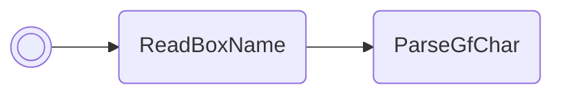

# Reseed RNG

Reseeds the RNG with the hexadecimal value written in box 1's name. Really
useful for RNG manipulation, useless otherwise.

/// pokemon | Togetic ["ReseedRng"]
    open: true

//// tab | :octicons-cpu-24: ARM assembly
``` { .arm_v4 .annotate linenums="1" }
00 20           MOV     r0, #0
00 46           NOP
01 21           MOV     r1, #1
05 E0           B       #14
CC D9 E7 D9     .byte   "Rese"
D9 D8 CC E2     .byte   "edRn"
DB FF 02 02     .byte   "g", #0xFF, #0x02, #0x02
05 9A           LDR     r2, sp.ReadBoxName
96 46           CPY     lr, r2
00 F8           BL      lr
02 E0           B       #8
93 97
00 00
B1 01
02 49           LDR     r1, gRngValue
08 60           STR     r0, [r1]
00 20           MOV     r0, #0
12 E0           B       nextFreeBoxSlot
00 00

                gRngValue:
80 5D 00 03     .word   #0x03005D80
00 00 00 00
00 00 00 00
00 00 00 00
00 00 00 00
00 00 00 00
00 00 00 00
00 00 00 00
00 00 00 00
```
////

//// tab | :octicons-list-unordered-24: Box code

///// tab | Emerald
```box_code
Box  1: AC AA Rg Eh
Box  2: Be DM 2e fZ
Box  3: 2d jM 4t v?
Box  4: Ag IF mp ZG
Box  5: AP gC 4J OX
Box  6: AA Cx AQ JJ
Box  7: CG AA IB Lg
Box  8: AA CA XQ AD
```
/////

///// tab | FireRed/LeafGreen
```box_code
Box  1: AC AA Rg Eh
Box  2: Be DM 2e fZ
Box  3: 2d jM 4t v?
Box  4: Ag IF mp ZG
Box  5: AP gC 4B OM
Box  6: AA Cx AQ JJ
Box  7: CG AA IB Lg
Box  8: AA AA UA AD
```
/////

////

//// tab | :octicons-apps-24: PokeGlitzer

///// tab | Emerald
``` { .text .copy }
00 20 00 46   01 21 05 E0
CC D9 E7 D9   D9 D8 CC E2
DB FF 02 02   05 9A 96 46
00 F8 02 E0   93 97 00 00
B1 01 02 49   08 60 00 20
12 E0 00 00   80 5D 00 03
00 00 00 00   00 00 00 00
00 00 00 00   00 00 00 00
00 00 00 00   00 00 00 00
00 00 00 00   00 00 00 00
```
/////

///// tab | FireRed/LeafGreen
``` { .text .copy }
00 20 00 46   01 21 05 E0
CC D9 E7 D9   D9 D8 CC E2
DB FF 02 02   05 9A 96 46
00 F8 02 E0   13 8C 00 00
B1 01 02 49   08 60 00 20
12 E0 00 00   00 50 00 03
00 00 00 00   00 00 00 00
00 00 00 00   00 00 00 00
00 00 00 00   00 00 00 00
00 00 00 00   00 00 00 00
```
/////

////

//// tab | :octicons-arrow-switch-24: Signature

///// html | div.signature-typed
+-----------+---------------+---------------+
| IN        | Type          | Function      |
+===========+===============+===============+
| `BOX1`    | `Hexadecimal` | New RNG seed  |
+-----------+---------------+---------------+
/////

////

//// tab | :octicons-package-dependencies-24: Dependencies

////

///
