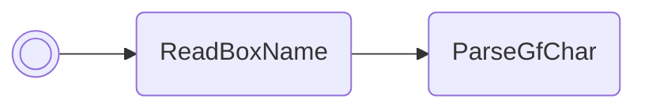

# Set ObjectEvent script pointer

Overrides the XSE script that is called when you talk to certain NPCs. A list of
useful script addresses can be found below:

/// html | div.address-book

//// tab | Emerald
+---------------+-------------------------------------------+
| Address       | Script                                    |
+===============+===========================================+
| `0x081F9E80`  | Upgrade to National Dex                   |
+---------------+-------------------------------------------+
| `0x0867550B`  | Mystic Ticket mystery gift                |
+---------------+-------------------------------------------+
| `0x0867533C`  | Aurora Ticket mystery gift                |
+---------------+-------------------------------------------+
| `0x086757F4`  | Old Sea Map mystery gift                  |
+---------------+-------------------------------------------+
| `0x08674D3D`  | Pichu egg event (unreleased)              |
+---------------+-------------------------------------------+
| `0x08273797`  | Nickname Pokémon in box 1, slot 1         |
+---------------+-------------------------------------------+
| `0x0822022F`  | On sale decorations shop                  |
+---------------+-------------------------------------------+
| `0x08201383`  | Move reminder (before heart scale check)  |
+---------------+-------------------------------------------+
| `0x082013D6`  | Move reminder (after heart scale check)   |
+---------------+-------------------------------------------+
| `0x0821EA0B`  | Move deleter                              |
+---------------+-------------------------------------------+
| `0x08265255`  | Battle Frontier move tutor, left          |
+---------------+-------------------------------------------+
| `0x08265445`  | Battle Frontier move tutor, right         |
+---------------+-------------------------------------------+
////

//// tab | FireRed v1.0
+---------------+-------------------------------------------+
| Address       | Script                                    |
+===============+===========================================+
| `0x08169035`  | Upgrade to National Dex                   |
+---------------+-------------------------------------------+
| `0x08170FA5`  | Give Sapphire to Celio                    |
+---------------+-------------------------------------------+
| `0x081710B2`  | Activate Rainbow Pass                     |
+---------------+-------------------------------------------+
| `0x08489689`  | Mystic Ticket mystery gift                |
+---------------+-------------------------------------------+
| `0x084894B9`  | Aurora Ticket mystery gift                |
+---------------+-------------------------------------------+
| `0x081A8C33`  | Nickname Pokémon in box 1, slot 1         |
+---------------+-------------------------------------------+
| `0x081716BE`  | Move reminder                             |
+---------------+-------------------------------------------+
| `0x0816D8B0`  | Move deleter                              |
+---------------+-------------------------------------------+
////

//// tab | FireRed v1.1
+---------------+-------------------------------------------+
| Address       | Script                                    |
+===============+===========================================+
| `0x081690AD`  | Upgrade to National Dex                   |
+---------------+-------------------------------------------+
| `0x0817101D`  | Give Sapphire to Celio                    |
+---------------+-------------------------------------------+
| `0x0817112A`  | Activate Rainbow Pass                     |
+---------------+-------------------------------------------+
| `0x084896E9`  | Mystic Ticket mystery gift                |
+---------------+-------------------------------------------+
| `0x08489519`  | Aurora Ticket mystery gift                |
+---------------+-------------------------------------------+
| `0x081A8CAB`  | Nickname Pokémon in box 1, slot 1         |
+---------------+-------------------------------------------+
| `0x08171736`  | Move reminder                             |
+---------------+-------------------------------------------+
| `0x0816D928`  | Move deleter                              |
+---------------+-------------------------------------------+
////

//// tab | LeafGreen v1.0
+---------------+-------------------------------------------+
| Address       | Script                                    |
+===============+===========================================+
| `0x08169011`  | Upgrade to National Dex                   |
+---------------+-------------------------------------------+
| `0x08170F81`  | Give Sapphire to Celio                    |
+---------------+-------------------------------------------+
| `0x0817108E`  | Activate Rainbow Pass                     |
+---------------+-------------------------------------------+
| `0x08488F65`  | Mystic Ticket mystery gift                |
+---------------+-------------------------------------------+
| `0x08488D95`  | Aurora Ticket mystery gift                |
+---------------+-------------------------------------------+
| `0x081A8C0F`  | Nickname Pokémon in box 1, slot 1         |
+---------------+-------------------------------------------+
| `0x0817169A`  | Move reminder                             |
+---------------+-------------------------------------------+
| `0x0816D88C`  | Move deleter                              |
+---------------+-------------------------------------------+
////

//// tab | LeafGreen v1.1
+---------------+-------------------------------------------+
| Address       | Script                                    |
+===============+===========================================+
| `0x08169089`  | Upgrade to National Dex                   |
+---------------+-------------------------------------------+
| `0x08170FF9`  | Give Sapphire to Celio                    |
+---------------+-------------------------------------------+
| `0x08171106`  | Activate Rainbow Pass                     |
+---------------+-------------------------------------------+
| `0x08488FD5`  | Mystic Ticket mystery gift                |
+---------------+-------------------------------------------+
| `0x08488E05`  | Aurora Ticket mystery gift                |
+---------------+-------------------------------------------+
| `0x081A8C87`  | Nickname Pokémon in box 1, slot 1         |
+---------------+-------------------------------------------+
| `0x08171712`  | Move reminder                             |
+---------------+-------------------------------------------+
| `0x0816D904`  | Move deleter                              |
+---------------+-------------------------------------------+
////

///

All of these address were pulled from [e-sh4rk's code generator](
https://e-sh4rk.github.io/CodeGenerator/index.html). Use other addresses at
your discretion.

This script always overrides the script for the 1st NPC on the map. Which NPC
this is can be pretty difficult to determine, but is conveniently always the
nurse when inside a Pokémon Center.

These overrides do not persist between map transitions.

/// pokemon | Shuppet ["SetScrPtr"]
    open: true

//// tab | :octicons-cpu-24: ARM assembly

///// tab | Emerald
``` { .arm_v4 .annotate linenums="1" }
DB 46           NOP
40 40           EOR     r0, r0
01 21           MOV     r1, #1
05 E0           B       #14
CD D9 E8 CD     .byte   "SetS"
D7 E6 CA E8     .byte   "crPt"
E6 FF 02 02     .byte   "r", #0xFF, #0x02, #0x02
05 9A           LDR     r2, sp.ReadBoxName
96 46           CPY     lr, r2
00 F8           BL      lr
02 E0           B       #8
B5 42
00 00
A3 66
01 99           LDR     r1, sp.gSaveBlock1
19 22           MOV     r2, #25
D2 01           LSL     r2, r2, #7
88 50           STR     r0, [r1, r2]
00 20           MOV     r0, #0
10 E0           B       nextFreeBoxSlot
00 00
00 00 00 00
00 00 00 00
00 00 00 00
00 00 00 00
00 00 00 00
00 00 00 00
00 00 00 00
00 00 00 00
```
/////

///// tab | FireRed/LeafGreen
``` { .arm_v4 .annotate linenums="1" }
DB 46           NOP
40 40           EOR     r0, r0
01 21           MOV     r1, #1
05 E0           B       #14
CD D9 E8 CD     .byte   "SetS"
D7 E6 CA E8     .byte   "crPt"
E6 FF 02 02     .byte   "r", #0xFF, #0x02, #0x02
05 9A           LDR     r2, sp.eevee
96 46           CPY     lr, r2
00 F8           BL      lr
02 E0           B       #8
07 42
00 00
A3 66
01 99           LDR     r1, sp.gSaveBlock1
8F 22           MOV     r2, #143
12 01           LSL     r2, r2, #4
88 50           STR     r0, [r1, r2]
00 20           MOV     r0, #0
10 E0           B       nextFreeBoxSlot
00 00
00 00 00 00
00 00 00 00
00 00 00 00
00 00 00 00
00 00 00 00
00 00 00 00
00 00 00 00
00 00 00 00
```
/////

////

//// tab | :octicons-list-unordered-24: Box code

///// tab | Emerald
```box_code
Box  1: 20 ZA QA Eh
Box  2: Be DN 2e jN
Box  3: 1! bK 6O b?
Box  4: Ag IF mp ZG
Box  5: AP gC 4L VC
Box  6: AA Cj Zg GZ
Box  7: GS LS AY hQ
Box  8: AC AQ 4A AA
```
/////

///// tab | FireRed/LeafGreen
```box_code
Box  1: 20 ZA QA Eh
Box  2: Be DN 2e jN
Box  3: 1! bK 6O b?
Box  4: Ag IF mp ZG
Box  5: AP gC 4A dC
Box  6: AA Cj Zg GZ
Box  7: jy IS AY hQ
Box  8: AC AQ 4A AA
```
/////

////

//// tab | :octicons-apps-24: PokeGlitzer

///// tab | Emerald
``` { .text .copy }
DB 46 40 40   01 21 05 E0
CD D9 E8 CD   D7 E6 CA E8
E6 FF 02 02   05 9A 96 46
00 F8 02 E0   B5 42 00 00
A3 66 01 99   19 22 D2 01
88 50 00 20   10 E0 00 00
00 00 00 00   00 00 00 00
00 00 00 00   00 00 00 00
00 00 00 00   00 00 00 00
00 00 00 00   00 00 00 00
```
/////

///// tab | FireRed/LeafGreen
``` { .text .copy }
DB 46 40 40   01 21 05 E0
CD D9 E8 CD   D7 E6 CA E8
E6 FF 02 02   05 9A 96 46
00 F8 02 E0   07 42 00 00
A3 66 01 99   8F 22 12 01
88 50 00 20   10 E0 00 00
00 00 00 00   00 00 00 00
00 00 00 00   00 00 00 00
00 00 00 00   00 00 00 00
00 00 00 00   00 00 00 00
```
/////

////

//// tab | :octicons-arrow-switch-24: Signature

///// html | div.signature-typed
+-----------+---------------+-------------------------------+
| IN        | Type          | Function                      |
+===========+===============+===============================+
| `BOX1`    | `Hexadecimal` | Address of script override    |
+-----------+---------------+-------------------------------+
/////

////

//// tab | :octicons-package-dependencies-24: Dependencies

////

///
