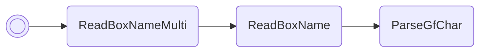

# Force egg PID

Functions very similarly to my "Reseed RNG" script, except it also sets
`vblankCounter2` at the same time. This is mostly useless; I'm using it to help
test out methods for RNGing Emerald egg PIDs.

Emerald only.

/// pokemon | Togetic ["ForceEgg"]
    open: true

//// tab | :octicons-cpu-24: ARM assembly
``` { .arm_v4 .annotate linenums="1" }
82 B0           SUB     sp, #8
68 46           CPY     r0, sp
03 21           MOV     r1, #0b11
04 E0           B       #12
C0 E3 E6 D7     .byte   "Forc"
D9 BF DB DB     .byte   "eEgg"
FF FF           .byte   #0xFF, #0xFF
02 22           MOV     r2, #2
08 9B           LDR     r3, sp.ReadBoxNameMulti
9E 46           CPY     lr, r3
00 F8           BL      lr
00 E0           B       #4
1B B0
03 BC           POP     { r0, r1 }
00 A2           ADR     r2, gRngValue
04 E0           B       #12

                gRngValue:
80 5D 00 03     .word   #0x03005D80

                vblankCounter2:
E4 22 00 03     .word   #0x030022E4
99 91
0C CA           LDMIA   r2, { r2, r3 }
10 60           STR     r0, [r2]
19 60           STR     r1, [r3]
00 20           MOV     r0, #0
0B E0           B       nextFreeBoxSlot
00 00 00 00
00 00 00 00
00 00 00 00
00 00 00 00
00 00 00 00
00 00 00 00
```
////

//// tab | :octicons-list-unordered-24: Box code

///// tab | Emerald
```box_code
Box  1: gr Bo Rg Mh
Box  2: BO DA 4! bX
Box  3: 2b ?b 2? ??
Box  4: Ai II m5 5G
Box  5: AP gA 4B uw
Box  6: A7 wA og Tg
Box  7: gF 0A A! Qi
Box  8: AA OZ kQ zK
Box  9: EG AZ YA Ag
Box 10: C! AA AA AA
```
/////

///// tab | FireRed/LeafGreen
```text
Not available
```
/////

////

//// tab | :octicons-apps-24: PokeGlitzer

///// tab | Emerald
``` { .text .copy }
82 B0 68 46   03 21 04 E0
C0 E3 E6 D7   D9 BF DB DB
FF FF 02 22   08 9B 9E 46
00 F8 00 E0   1B B0 03 BC
00 A2 04 E0   80 5D 00 03
E4 22 00 03   99 91 0C CA
10 60 19 60   00 20 0B E0
00 00 00 00   00 00 00 00
00 00 00 00   00 00 00 00
00 00 00 00   00 00 00 00
```
/////

///// tab | FireRed/LeafGreen
```text
Not available
```
/////

////

//// tab | :octicons-arrow-switch-24: Signature

///// html | div.signature-typed
+-----------+---------------+-----------------------+
| IN        | Type          | Function              |
+===========+===============+=======================+
| `BOX1`    | `Hexadecimal` | New RNG seed          |
+-----------+---------------+-----------------------+
| `BOX2`    | `Hexadecimal` | New VBLNAK counter    |
+-----------+---------------+-----------------------+
/////

////

//// tab | :octicons-package-dependencies-24: Dependencies

////

///
