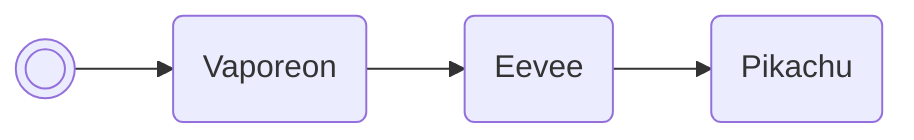

# Add item to PC

Attempts to place the desired quantity of the desired item into the player's PC
storage. This script will fail if there's not enough room.

/// pokemon | Meowth ["GetItem"]
    open: true

//// tab | :octicons-cpu-24: ARM assembly
``` { .arm_v4 .annotate linenums="1" }
82 B0           SUB     sp, #8
01 46           NOP
68 46           CPY     r0, sp
03 E0           B       #10
C1 D9 E8 C3     .byte   "GetI"
E8 D9 E1 FF     .byte   "tem", #0xFF
01 21           MOV     r1, #1
02 22           MOV     r2, #2
08 9B           LR      r3, sp.vaporeon
9E 46           CPY     lr, r3
00 F8           BL      lr
02 E0           B       #8
B8 B5
00 00
DE F6
03 BC           POP     { r0, r1 }
02 4A           LDR     r2, AddPCItem
96 46           CPY     lr, r2
00 F8           BL      lr
01 38           SUB     r0, #1
10 E0           B       nextBoxSlot
00 00
                AddPCItem:
71 6D 0D 08     .word   #0x080D6D71
00 00 00 00
00 00 00 00
00 00 00 00
00 00 00 00
00 00 00 00
00 00 00 00
00 00 00 00
```
////

//// tab | :octicons-list-unordered-24: Box code

///// tab | Emerald
```box_code
Box  1: gr AB Rm hG
Box  2: A! DB 2e jD
Box  3: 6N nh ?w Eh
Box  4: Ai II m5 5G
Box  5: AP gC 4L i1
Box  6: AA De 9g O8
Box  7: Ak qW Rg D4
Box  8: AT gQ 4A AA
Box  9: cW 0N CA AA
```
/////

///// tab | FireRed v1.0
```box_code
Box  1: gr AB Rm hG
Box  2: A! DB 2e jD
Box  3: 6N nh ?w Eh
Box  4: Ai II m5 5G
Box  5: AP gC 4D xv
Box  6: AA De 9g O8
Box  7: Ak qW Rg D4
Box  8: AT gQ 4A AA
Box  9: ya MJ CA AA
```
/////

///// tab | FireRed v1.1
```box_code
Box  1: gr AB Rm hG
Box  2: A! DB 2e jD
Box  3: 6N nh ?w Eh
Box  4: Ai II m5 5G
Box  5: AP gC 4F Bv
Box  6: AA De 9g O8
Box  7: Ak qW Rg D4
Box  8: AT gQ 4A AA
Box  9: 3a MJ CA AA
```
/////

///// tab | LeafGreen v1.0
```box_code
Box  1: gr AB Rm hG
Box  2: A! DB 2e jD
Box  3: 6N nh ?w Eh
Box  4: Ai II m5 5G
Box  5: AP gC 4J Bv
Box  6: AA De 9g O8
Box  7: Ak qW Rg D4
Box  8: AT gQ 4A AA
Box  9: na MJ CA AA
```
/////

///// tab | LeafGreen v1.1
```box_code
Box  1: gr AB Rm hG
Box  2: A! DB 2e jD
Box  3: 6N nh ?w Eh
Box  4: Ai II m5 5G
Box  5: AP gC 4H Rv
Box  6: AA De 9g O8
Box  7: Ak qW Rg D4
Box  8: AT gQ 4A AA
Box  9: sa MJ CA AA
```
/////

////

//// tab | :octicons-apps-24: PokeGlitzer

///// tab | Emerald
``` { .text .copy }
82 B0 01 46   68 46 03 E0
C1 D9 E8 C3   E8 D9 E1 FF
01 21 02 22   08 9B 9E 46
00 F8 02 E0   B8 B5 00 00
DE F6 03 BC   02 4A 96 46
00 F8 01 38   10 E0 00 00
71 6D 0D 08   00 00 00 00
00 00 00 00   00 00 00 00
00 00 00 00   00 00 00 00
00 00 00 00   00 00 00 00
```
/////

///// tab | FireRed v1.0
``` { .text .copy }
82 B0 01 46   68 46 03 E0
C1 D9 E8 C3   E8 D9 E1 FF
01 21 02 22   08 9B 9E 46
00 F8 02 E0   3C 6F 00 00
DE F6 03 BC   02 4A 96 46
00 F8 01 38   10 E0 00 00
C9 A3 09 08   00 00 00 00
00 00 00 00   00 00 00 00
00 00 00 00   00 00 00 00
00 00 00 00   00 00 00 00
```
/////

///// tab | FireRed v1.1
``` { .text .copy }
82 B0 01 46   68 46 03 E0
C1 D9 E8 C3   E8 D9 E1 FF
01 21 02 22   08 9B 9E 46
00 F8 02 E0   50 6F 00 00
DE F6 03 BC   02 4A 96 46
00 F8 01 38   10 E0 00 00
DD A3 09 08   00 00 00 00
00 00 00 00   00 00 00 00
00 00 00 00   00 00 00 00
00 00 00 00   00 00 00 00
```
/////

///// tab | LeafGreen v1.0
``` { .text .copy }
82 B0 01 46   68 46 03 E0
C1 D9 E8 C3   E8 D9 E1 FF
01 21 02 22   08 9B 9E 46
00 F8 02 E0   90 6F 00 00
DE F6 03 BC   02 4A 96 46
00 F8 01 38   10 E0 00 00
9D A3 09 08   00 00 00 00
00 00 00 00   00 00 00 00
00 00 00 00   00 00 00 00
00 00 00 00   00 00 00 00
```
/////

///// tab | LeafGreen v1.1
``` { .text .copy }
82 B0 01 46   68 46 03 E0
C1 D9 E8 C3   E8 D9 E1 FF
01 21 02 22   08 9B 9E 46
00 F8 02 E0   74 6F 00 00
DE F6 03 BC   02 4A 96 46
00 F8 01 38   10 E0 00 00
B1 A3 09 08   00 00 00 00
00 00 00 00   00 00 00 00
00 00 00 00   00 00 00 00
00 00 00 00   00 00 00 00
```
/////

////

//// tab | :octicons-arrow-switch-24: Signature

///// html | div.signature-typed
+-----------+---------------+-------------------+
| IN        | Type          | Function          |
+===========+===============+===================+
| `BOX1`    | `Hexadecimal` | ID of item to add |
+-----------+---------------+-------------------+
| `BOX2`    | `Decimal`     | Quantity to add   |
+-----------+---------------+-------------------+
/////

////

//// tab | :octicons-package-dependencies-24: Dependencies

////

///
