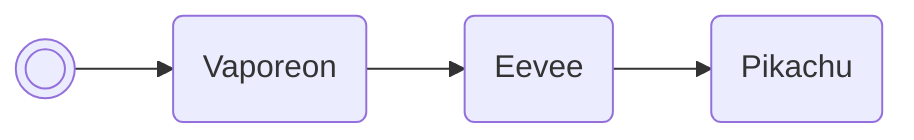

# Change TID/SID

Changes the player's trainer ID & secret ID.

/// pokemon | Girafarig ["SetPlrId"]
    open: true

//// tab | :octicons-cpu-24: ARM assembly
``` { .arm_v4 .annotate linenums="1" }
82 B0           SUB     sp, #8
68 46           CPY     r0, sp
00 21           MOV     r1, #0
04 E0           B       #14
CD D9 E8 CA     .byte   "SetP"
E0 E6 C3 D8     .byte   "lrId"
FF FF           .byte   #0xFF, #0xFF
02 22           MOV     r2, #2
08 9B           LDR     r3, sp.vaporeon
9E 46           CPY     lr, r3
00 F8           BL      lr
00 E0           B       #4
DE 47
03 BC           POP     { r0, r1 }
02 9A           LDR     r2, sp.gSaveBlock2
50 81           STRH    r0, [r2, #10]
91 81           STRH    r1, [r2, #12]
00 20           MOV     r0, #0
12 E0           B       nextFreeBoxSlot
00 00
49 91 00 00
00 00 00 00
00 00 00 00
00 00 00 00
00 00 00 00
00 00 00 00
00 00 00 00
00 00 00 00
00 00 00 00
```
////

//// tab | :octicons-list-unordered-24: Box code
```box_code
Box  1: gr Bo Rg Ah
Box  2: BO DN 2e jK
Box  3: 4O bD 2P ??
Box  4: Ai II m5 5G
Box  5: AP gA 4N 5H
Box  6: A7 wC ml CB
Box  7: kY EA IB Lg
Box  8: AA BJ kQ AA
```
////

//// tab | :octicons-apps-24: PokeGlitzer
``` { .text .copy }
82 B0 68 46   00 21 04 E0
CD D9 E8 CA   E0 E6 C3 D8
FF FF 02 22   08 9B 9E 46
00 F8 00 E0   DE 47 03 BC
02 9A 50 81   91 81 00 20
12 E0 00 00   49 91 00 00
00 00 00 00   00 00 00 00
00 00 00 00   00 00 00 00
00 00 00 00   00 00 00 00
00 00 00 00   00 00 00 00
```
////

//// tab | :octicons-arrow-switch-24: Signature

///// html | div.signature-typed
+-----------+---------------+-----------------------+
| IN        | Type          | Function              |
+===========+===============+=======================+
| `BOX1`    | `Decimal`     | Desired trainer ID    |
+-----------+---------------+-----------------------+
| `BOX2`    | `Decimal`     | Desired secret ID     |
+-----------+---------------+-----------------------+
/////

////

//// tab | :octicons-package-dependencies-24: Dependencies

////

///
