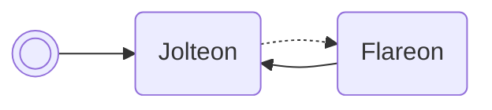

# Read SID

Reads the player's secret ID & prints it in box 1's name.

/// pokemon | Misdreavus ["ReadPlrSid"]
    open: true

//// tab | :octicons-cpu-24: ARM assembly
``` { .arm_v4 .annotate linenums="1" }
00 20           MOV     r0, #0
00 46           NOP
00 21           MOV     r1, #0
05 E0           B       #14
CC D9 D5 D8     .byte   "Read"
CA E0 E6 CD     .byte   "PlrS"
DD D8 02 02     .byte   "id", #0x02, #0x02
02 9A           LDR     r2, sp.gSaveBlock2
92 89           LDRH    r2, [r2, #12]
07 9B           LDR     r3, sp.jolteon
02 E0           B       #8
AC C6
00 00
C8 01
9E 46           CPY     lr, r3
00 F8           BL      lr
00 20           MOV     r0, #0
12 E0           B       nextBoxSlot
00 00
00 00 00 00
00 00 00 00
00 00 00 00
00 00 00 00
00 00 00 00
00 00 00 00
00 00 00 00
00 00 00 00
00 00 00 00
```
////

//// tab | :octicons-list-unordered-24: Box code
```box_code
Box  1: AC AA Rg Ah
Box  2: Be DM 2d XY
Box  3: yu Dm zd 3Y
Box  4: Ag IC mp KJ
Box  5: B5 sC 4K zG
Box  6: AA DI AZ 5G
Box  7: AP gA IB Lg
```
////

//// tab | :octicons-apps-24: PokeGlitzer
``` { .text .copy }
00 20 00 46   00 21 05 E0
CC D9 D5 D8   CA E0 E6 CD
DD D8 02 02   02 9A 92 89
07 9B 02 E0   AC C6 00 00
C8 01 9E 46   00 F8 00 20
12 E0 00 00   00 00 00 00
00 00 00 00   00 00 00 00
00 00 00 00   00 00 00 00
00 00 00 00   00 00 00 00
00 00 00 00   00 00 00 00
```
////

//// tab | :octicons-arrow-switch-24: Signature

///// html | div.signature-typed
+-----------+---------------+-----------------------+
| OUT       | Type          | Function              |
+===========+===============+=======================+
| `BOX1`    | `Decimal`     | Player's secret ID    |
+-----------+---------------+-----------------------+
/////

////

//// tab | :octicons-package-dependencies-24: Dependencies

////

///
