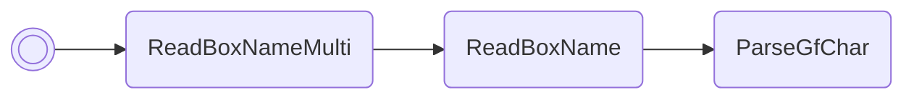

# Change EVs

Overwrites the EVs of the Pokémon in box 1, slot 1. It will not prevent you from
assigning more than 510 EVs! Count carefully if you want your Pokémon to be
legal.

If you attempt to set an EV to a value greater than 255, it will instead be set
to that value mod 256.

/// pokemon | Swampert ["SetEvs"]
    open: true

//// tab | :octicons-cpu-24: ARM assembly
``` { .arm_v4 .annotate linenums="1" }
86 B0           SUB     sp, #24
00 46           NOP
68 46           CPY     r0, sp
03 E0           B       #10
CD D9 E8 BF     .byte   "SetE"
EA E7 FF FF     .byte   "vs", #0xFF, #0xFF
0C 9B           LDR     r3, sp.ReadBoxNameMulti
02 42           NOP
00 21           MOV     r1, #0
06 22           MOV     r2, #6
9E 46           CPY     lr, r3
00 E0           B       #4
01 D6
00 F8           BL      lr
09 9C           LDR     r4, sp.gPokemonStorage
1A 25           MOV     r5, #0x1A

                statLoop:
20 1D           ADD     r0, r4, #4
29 46           CPY     r1, r5
6A 46           CPY     r2, sp
06 4B           LDR     r3, SetBoxMonData
9E 46           CPY     lr, r3
00 F8           BL      lr
01 B0           ADD     sp, #4
02 E0           B       #8
00 00
00 00
F3 F7
01 35           ADD     r5, #1
20 2D           CMP     r5, #0x20
F1 D3           BLO     statLoop
00 20           MOV     r0, #0
06 E0           B       nextFreeBoxSlot

                SetBoxMonData:
9D AD 06 08     .word   #0x0806AD9D
```
////

//// tab | :octicons-list-unordered-24: Box code

///// tab | Emerald
```box_code
Box  1: hr AA Rm hG
Box  2: A! DN 2e i?
Box  3: 6u f? ?w yb
Box  4: Ak IA IQ Yi
Box  5: nk YA 4A HW
Box  6: AP gJ nB ol
Box  7: IB 0p Rm pG
Box  8: Bk ue Rg D4
Box  9: Ab AC 4A AA
Box 10: AA Dz 9w E1
Box 11: IC 3x 0w Ag
Box 12: Bu Cd rQ YI
```
/////

///// tab | FireRed/LeafGreen v1.0
```box_code
Box  1: hr AA Rm hG
Box  2: A! DN 2e i?
Box  3: 6u f? ?w yb
Box  4: Ak IA IQ Yi
Box  5: nk YA 4M 5s
Box  6: AP gJ nB ol
Box  7: IB 0p Rm pG
Box  8: Bk ue Rg D4
Box  9: Ab AC 4A AA
Box 10: AA Dz 9w E1
Box 11: IC 3x 0w Ag
Box 12: Bu DQ BA QI
```
/////

///// tab | FireRed/LeafGreen v1.1
```box_code
Box  1: hr AA Rm hG
Box  2: A! DN 2e i?
Box  3: 6u f? ?w yb
Box  4: Ak IA IQ Yi
Box  5: nk YA 4J ps
Box  6: AP gJ nB ol
Box  7: IB 0p Rm pG
Box  8: Bk ue Rg D4
Box  9: Ab AC 4A AA
Box 10: AA Dz 9w E1
Box 11: IC 3x 0w Ag
Box 12: Bu Dk BA QI
```
/////

////

//// tab | :octicons-apps-24: PokeGlitzer

///// tab | Emerald
``` { .text .copy }
86 B0 00 46   68 46 03 E0
CD D9 E8 BF   EA E7 FF FF
0C 9B 02 42   00 21 06 22
9E 46 00 E0   01 D6 00 F8
09 9C 1A 25   20 1D 29 46
6A 46 06 4B   9E 46 00 F8
01 B0 02 E0   00 00 00 00
F3 F7 01 35   20 2D F1 D3
00 20 06 E0   9D AD 06 08
00 00 00 00   00 00 00 00
```
/////

///// tab | FireRed/LeafGreen v1.0
``` { .text .copy }
86 B0 00 46   68 46 03 E0
CD D9 E8 BF   EA E7 FF FF
0C 9B 02 42   00 21 06 22
9E 46 00 E0   CE 6C 00 F8
09 9C 1A 25   20 1D 29 46
6A 46 06 4B   9E 46 00 F8
01 B0 02 E0   00 00 00 00
F3 F7 01 35   20 2D F1 D3
00 20 06 E0   D0 04 04 08
00 00 00 00   00 00 00 00
```
/////

///// tab | FireRed/LeafGreen v1.1
``` { .text .copy }
86 B0 00 46   68 46 03 E0
CD D9 E8 BF   EA E7 FF FF
0C 9B 02 42   00 21 06 22
9E 46 00 E0   9A 6C 00 F8
09 9C 1A 25   20 1D 29 46
6A 46 06 4B   9E 46 00 F8
01 B0 02 E0   00 00 00 00
F3 F7 01 35   20 2D F1 D3
00 20 06 E0   E4 04 04 08
00 00 00 00   00 00 00 00
```
/////

////

//// tab | :octicons-arrow-switch-24: Signature

///// html | div.signature-typed
+-----------+---------------+-------------------+
| IN        | Type          | Function          |
+===========+===============+===================+
| `BOX1`    | `Decimal`     | Desired HP EVs    |
+-----------+---------------+-------------------+
| `BOX2`    | `Decimal`     | Desired Atk EVs   |
+-----------+---------------+-------------------+
| `BOX3`    | `Decimal`     | Desired Def EVs   |
+-----------+---------------+-------------------+
| `BOX4`    | `Decimal`     | Desired Spe EVs   |
+-----------+---------------+-------------------+
| `BOX5`    | `Decimal`     | Desired SpA EVs   |
+-----------+---------------+-------------------+
| `BOX6`    | `Decimal`     | Desired SpD EVs   |
+-----------+---------------+-------------------+
/////

////

//// tab | :octicons-package-dependencies-24: Dependencies

////

///
