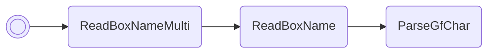

# Change moveset

Overwrites all 4 moves of the Pokémon in box 1, slot 1. Glitch moves are _not_
filtered out or prevented, so be careful.

/// pokemon | Clefairy ["SetMoveset"]
    open: true

//// tab | :octicons-cpu-24: ARM assembly
``` { .arm_v4 .annotate linenums="1" }
84 B0           SUB     sp, #16
68 46           CPY     r0, sp
0F 21           MOV     r1, #15
05 E0           B       #14
CD D9 E8 C7     .byte   "SetM"
E3 EA D9 E7     .byte   "oves"
D9 E8 02 02     .byte   "et", #0x02, #0x02
04 22           MOV     r2, #4
0A 9B           LDR     r3, sp.ReadBoxNameMulti
9E 46           CPY     lr, r3
00 E0           B       #4
C1 D0
00 F8           BL      lr
07 9C           LDR     r4, sp.gPokemonStorage
00 25           MOV     r5, #0
07 4E           LDR     r6, SetMonMoveSlot

                moveSlotLoop:
20 1D           ADD     r0, r4, #4
00 99           LDR     r1, [sp]
2A 46           CPY     r2, r5
B6 46           CPY     lr, r6
00 F8           BL      lr
01 B0           ADD     sp, #4
02 E0           B       #8
00 00
00 00
A8 91
01 35           ADD     r5, #1
03 2D           CMP     r5, #3
F2 D9           BLS     moveSlotLoop
00 20           MOV     r0, #0
05 E0           B       nextFreeBoxSlot

                SetMonMoveSlot
F5 91 06 08     .word   #0x080691F5
00 00 00 00
00 00 00 00
```
////

//// tab | :octicons-list-unordered-24: Box code

///// tab | Emerald
```box_code
Box  1: hL Bo Rg 8h
Box  2: Be DN 2e jH
Box  3: 4! rZ 59 no
Box  4: Ag IE Ig qb
Box  5: nk YA 4M HQ
Box  6: AP gH nA Al
Box  7: B0 4g HQ CZ
Box  8: Kk a2 Rg D4
Box  9: Ab AC 4A AA
Box 10: AA Co kQ E1
Box 11: Ay 3y 2Q Ag
Box 12: Be D1 kQ YI
```
/////

///// tab | FireRed v1.0
```box_code
Box  1: hL Bo Rg 8h
Box  2: Be DN 2e jH
Box  3: 4! rZ 59 no
Box  4: Ag IE Ig qb
Box  5: nk YA 4D RJ
Box  6: AP gH nA Al
Box  7: B0 4g HQ CZ
Box  8: Kk a2 Rg D4
Box  9: Ab AC 4A AA
Box 10: AA Co kQ E1
Box 11: Ay 3y 2Q Ag
Box 12: Be Bl 6Q MI
```
/////

///// tab | FireRed v1.1
```box_code
Box  1: hL Bo Rg 8h
Box  2: Be DN 2e jH
Box  3: 4! rZ 59 no
Box  4: Ag IE Ig qb
Box  5: nk YA 4D hJ
Box  6: AP gH nA Al
Box  7: B0 4g HQ CZ
Box  8: Kk a2 Rg D4
Box  9: Ab AC 4A AA
Box 10: AA Co kQ E1
Box 11: Ay 3y 2Q Ag
Box 12: Be B5 6Q MI
```
/////

////

//// tab | :octicons-apps-24: PokeGlitzer

///// tab | Emerald
``` { .text .copy }
84 B0 68 46   0F 21 05 E0
CD D9 E8 C7   E3 EA D9 E7
D9 E8 02 02   04 22 0A 9B
9E 46 00 E0   C1 D0 00 F8
07 9C 00 25   07 4E 20 1D
00 99 2A 46   B6 46 00 F8
01 B0 02 E0   00 00 00 00
A8 91 01 35   03 2D F2 D9
00 20 05 E0   F5 91 06 08
00 00 00 00   00 00 00 00
```
/////

///// tab | FireRed v1.0
``` { .text .copy }
84 B0 68 46   0F 21 05 E0
CD D9 E8 C7   E3 EA D9 E7
D9 E8 02 02   04 22 0A 9B
9E 46 00 E0   34 49 00 F8
07 9C 00 25   07 4E 20 1D
00 99 2A 46   B6 46 00 F8
01 B0 02 E0   00 00 00 00
A8 91 01 35   03 2D F2 D9
00 20 05 E0   65 E9 03 08
00 00 00 00   00 00 00 00
```
/////

///// tab | FireRed v1.1
``` { .text .copy }
84 B0 68 46   0F 21 05 E0
CD D9 E8 C7   E3 EA D9 E7
D9 E8 02 02   04 22 0A 9B
9E 46 00 E0   38 49 00 F8
07 9C 00 25   07 4E 20 1D
00 99 2A 46   B6 46 00 F8
01 B0 02 E0   00 00 00 00
A8 91 01 35   03 2D F2 D9
00 20 05 E0   79 E9 03 08
00 00 00 00   00 00 00 00
```
/////

////

//// tab | :octicons-arrow-switch-24: Signature

///// html | div.signature-typed
+-----------+---------------+-------------------+
| IN        | Type          | Function          |
+===========+===============+===================+
| `BOX1`    | `Hexadecimal` | Move slot #1 ID   |
+-----------+---------------+-------------------+
| `BOX2`    | `Hexadecimal` | Move slot #2 ID   |
+-----------+---------------+-------------------+
| `BOX3`    | `Hexadecimal` | Move slot #3 ID   |
+-----------+---------------+-------------------+
| `BOX4`    | `Hexadecimal` | Move slot #4 ID   |
+-----------+---------------+-------------------+
/////

////

////

//// tab | :octicons-package-dependencies-24: Dependencies

////

///
