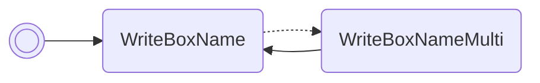

# Read daycare egg PID

Prints the PID of the egg currently in the daycare in box 1's name. If there is
no egg, it will print `00000000`.

/// pokemon | Pidgeot ["ReadEggPid"]
    open: true

//// tab | :octicons-cpu-24: ARM assembly

///// tab | Emerald
``` { .arm_v4 .annotate linenums="1" }
00 20           MOV     r0, #0
00 46           NOP
01 21           MOV     r1, #1
05 E0           B       #14
CC D9 D5 D8     .byte   "Read"
BF DB DB CA     .byte   "EggP"
DD D8 02 02     .byte   "id", #0x02, #0x02
01 9A           LDR     r2, sp.gSaveBlock1
31 23           MOV     r3, #0x31
1B 02           LSL     r3, r3, #8
02 E0           B       #8
13 71
00 00
13 01
48 33           ADD     r3, #0x48
D2 58           LDR     r2, [r2, r3]
07 9B           LDR     r3, sp.WriteBoxName
9E 46           CPY     lr, r3
00 F8           BL      lr
00 20           MOV     r0, #0
0F E0           B       nextFreeBoxSlot
00 00 00 00
00 00 00 00
00 00 00 00
00 00 00 00
00 00 00 00
00 00 00 00
00 00 00 00
00 00 00 00
```
/////

///// tab | FireRed/LeafGreen
```text
Not available
```
/////

////

//// tab | :octicons-list-unordered-24: Box code

///// tab | Emerald
```box_code
Box  1: AC AA Rg Eh
Box  2: Be DM 2d XY
Box  3: v9 vb yt 3Y
Box  4: Ag IB mj Ej
Box  5: Gw IC 4B Nx
Box  6: AA AT AU gz
Box  7: 0l gH m5 5G
Box  8: AP gA IA ?g
```
/////

///// tab | FireRed/LeafGreen
```text
Not available
```
/////

////

//// tab | :octicons-apps-24: PokeGlitzer

///// tab | Emerald
``` { .text .copy }
00 20 00 46   01 21 05 E0
CC D9 D5 D8   BF DB DB CA
DD D8 02 02   01 9A 31 23
1B 02 02 E0   13 71 00 00
13 01 48 33   D2 58 07 9B
9E 46 00 F8   00 20 0F E0
00 00 00 00   00 00 00 00
00 00 00 00   00 00 00 00
00 00 00 00   00 00 00 00
00 00 00 00   00 00 00 00
```
/////

///// tab | FireRed/LeafGreen
```text
Not available
```
/////

////

//// tab | :octicons-arrow-switch-24: Signature

///// html | div.signature-typed
+-----------+---------------+-----------------------------------------------+
| OUT       | Type          | Function                                      |
+===========+===============+===============================================+
| `BOX1`    | `Hexadecimal` | Personality value of the unclaimed daycare    |
|           |               | egg                                           |
+-----------+---------------+-----------------------------------------------+
/////

////

//// tab | :octicons-package-dependencies-24: Dependencies

////

///
