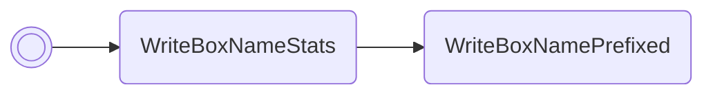

# Read IVs

Reads the IVs of the Pokémon in box 1, slot 1 and prints them in the first 6 box
names. The order of the values will be HP/Atk/Def/Spe/SpA/SpD.

/// pokemon | Metagross ["ReadIvs"]
    open: true

//// tab | :octicons-cpu-24: ARM assembly
``` { .arm_v4 .annotate linenums="1" }
F6 46           NOP
03 9C           LDR     r4, sp.gPokemonStorage
2C 25           MOV     r5, #0x2C
03 E0           B       #10
CC D9 D5 D8     .byte   "Read"
C3 EA E7 FF     .byte   "Ivs", #0xFF
0A 4E           LDR     r6, GetBoxMonData
02 42           NOP

                statLoop:
20 1D           ADD     r0, r4, #4
29 46           CPY     r1, r5
B6 46           CPY     lr, r6
00 E0           B       #4
43 31
00 F8           BL      lr
01 B4           PUSH    { r0 }
01 3D           SUB     r5, #1
27 2D           CMP     r5, #0x27
F5 D2           BHS     statLoop
68 46           CPY     r0, sp
10 99           LDR     r1, sp.umbreon
8E 46           CPY     lr, r1
00 F8           BL      lr
06 B0           ADD     sp, #24
00 20           MOV     r0, #0
0C E0           B       nextFreeBoxSlot
00 00
4A 62
00 00

                GetBoxMonData:
75 A6 06 08     .word   #0x0806A675
00 00 00 00
00 00 00 00
00 00 00 00
00 00 00 00
```
////

//// tab | :octicons-list-unordered-24: Box code

///// tab | Emerald
```box_code
Box  1: 9k YD nC wl
Box  2: A! DM 2d XY
Box  3: w! rn ?w pO
Box  4: Ak Ig HS lG
Box  5: tk YA 4E Mx
Box  6: AP gB tA E9
Box  7: Jy 31 0m hG
Box  8: EJ mO Rg D4
Box  9: Br AA IA zg
Box 10: AA BK Yg AA
Box 11: da YG CA AA
```
/////

///// tab | FireRed/LeafGreen v1.0
```box_code
Box  1: 9k YD nC wl
Box  2: A! DM 2d XY
Box  3: w! rn ?w pO
Box  4: Ak Ig HS lG
Box  5: tk YA 4D AK
Box  6: AP gB tA E9
Box  7: Jy 31 0m hG
Box  8: EJ mO Rg D4
Box  9: Br AA IA zg
Box 10: AA BK Yg AA
Box 11: Rf 0D CA AA
```
/////

///// tab | FireRed/LeafGreen v1.1
```box_code
Box  1: 9k YD nC wl
Box  2: A! DM 2d XY
Box  3: w! rn ?w pO
Box  4: Ak Ig HS lG
Box  5: tk YA 4B QK
Box  6: AP gB tA E9
Box  7: Jy 31 0m hG
Box  8: EJ mO Rg D4
Box  9: Br AA IA zg
Box 10: AA BK Yg AA
Box 11: Wf 0D CA AA
```
/////

////

//// tab | :octicons-apps-24: PokeGlitzer

///// tab | Emerald
``` { .text .copy }
F6 46 03 9C   2C 25 03 E0
CC D9 D5 D8   C3 EA E7 FF
0A 4E 02 42   20 1D 29 46
B6 46 00 E0   43 31 00 F8
01 B4 01 3D   27 2D F5 D2
68 46 10 99   8E 46 00 F8
06 B0 00 20   0C E0 00 00
4A 62 00 00   75 A6 06 08
00 00 00 00   00 00 00 00
00 00 00 00   00 00 00 00
```
/////

///// tab | FireRed/LeafGreen v1.0
``` { .text .copy }
F6 46 03 9C   2C 25 03 E0
CC D9 D5 D8   C3 EA E7 FF
0A 4E 02 42   20 1D 29 46
B6 46 00 E0   30 0A 00 F8
01 B4 01 3D   27 2D F5 D2
68 46 10 99   8E 46 00 F8
06 B0 00 20   0C E0 00 00
4A 62 00 00   45 FD 03 08
00 00 00 00   00 00 00 00
00 00 00 00   00 00 00 00
```
/////

///// tab | FireRed/LeafGreen v1.1
``` { .text .copy }
F6 46 03 9C   2C 25 03 E0
CC D9 D5 D8   C3 EA E7 FF
0A 4E 02 42   20 1D 29 46
B6 46 00 E0   14 0A 00 F8
01 B4 01 3D   27 2D F5 D2
68 46 10 99   8E 46 00 F8
06 B0 00 20   0C E0 00 00
4A 62 00 00   59 FD 03 08
00 00 00 00   00 00 00 00
00 00 00 00   00 00 00 00
```
/////

////

//// tab | :octicons-arrow-switch-24: Signature

///// html | div.signature-typed
+-----------+---------------+-----------------------+
| OUT       | Type          | Function              |
+===========+===============+=======================+
| `BOX1`    | `Decimal`     | HP IV                 |
+-----------+---------------+-----------------------+
| `BOX2`    | `Decimal`     | Attack IV             |
+-----------+---------------+-----------------------+
| `BOX3`    | `Decimal`     | Defense IV            |
+-----------+---------------+-----------------------+
| `BOX4`    | `Decimal`     | Speed IV              |
+-----------+---------------+-----------------------+
| `BOX5`    | `Decimal`     | Special attack IV     |
+-----------+---------------+-----------------------+
| `BOX6`    | `Decimal`     | Special defense IV    |
+-----------+---------------+-----------------------+
/////

////

//// tab | :octicons-package-dependencies-24: Dependencies

////

///
