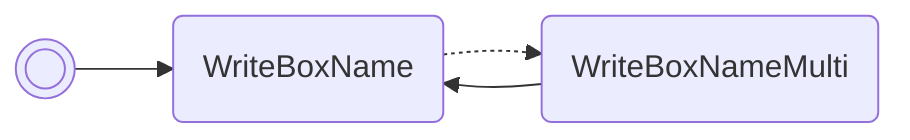

# Read OT SID

Reads the OT SID of the Pokémon in box 1, slot 1 and prints it in box 1's name.

/// pokemon | Sneasel ["ReadOtSid"]
    open: true

//// tab | :octicons-cpu-24: ARM assembly
``` { .arm_v4 .annotate linenums="1" }
00 20           MOV     r0, #0
00 46           NOP
00 21           MOV     r1, #0
05 E0           B       #14
CC D9 D5 D8     .byte   "Read"
C9 E8 CD DD     .byte   "OtSi"
D8 FF 02 02     .byte   "d", #0xFF, #0x02, #0x02
03 9A           LDR     r2, sp.gPokemonStorage
52 89           LDRH    r2, [r2, #10]
07 9B           LDR     r3, sp.jolteon
02 E0           B       #8
BB C6
00 00
D7 01
9E 46           CPY     lr, r3
00 F8           BL      lr
00 20           MOV     r0, #0
12 E0           B       nextFreeBoxSlot
00 00
00 00 00 00
00 00 00 00
00 00 00 00
00 00 00 00
00 00 00 00
00 00 00 00
00 00 00 00
00 00 00 00
00 00 00 00
```
////

//// tab | :octicons-list-unordered-24: Box code
```box_code
Box  1: AC AA Rg Ah
Box  2: Be DM 2d XY
Box  3: ye jN 3d j?
Box  4: Ag ID ml KJ
Box  5: B5 sC 4L vG
Box  6: AA DX AZ 5G
Box  7: AP gA IB Lg
```
////

//// tab | :octicons-apps-24: PokeGlitzer
``` { .text .copy }
00 20 00 46   00 21 05 E0
CC D9 D5 D8   C9 E8 CD DD
D8 FF 02 02   03 9A 52 89
07 9B 02 E0   BB C6 00 00
D7 01 9E 46   00 F8 00 20
12 E0 00 00   00 00 00 00
00 00 00 00   00 00 00 00
00 00 00 00   00 00 00 00
00 00 00 00   00 00 00 00
00 00 00 00   00 00 00 00
```
////

//// tab | :octicons-arrow-switch-24: Signature

///// html | div.signature-typed
+-----------+---------------+-------------------------------+
| OUT       | Type          | Function                      |
+===========+===============+===============================+
| `BOX1`    | `Decimal`     | Original trainer's secret ID  |
+-----------+---------------+-------------------------------+
/////

////

//// tab | :octicons-package-dependencies-24: Dependencies

////

///
