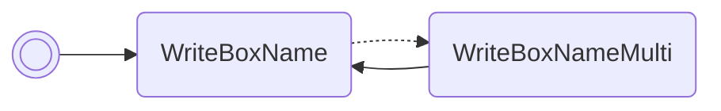

# Read PID

Reads the personality value of the Pokémon in box 1, slot 1 and prints it in box
1's name.

/// pokemon | Spinda ["ReadPid"]
    open: true

//// tab | :octicons-cpu-24: ARM assembly
``` { .arm_v4 .annotate linenums="1" }
00 20           MOV     r0, #0
00 46           NOP
01 21           MOV     r1, #1
03 E0           B       #10
CC D9 D5 D8     .byte   "Read"
CA DD D8 FF     .byte   "Pid", #0xFF
03 9A           LDR     r2, sp.gPokemonStorage
02 42           NOP
52 68           LDR     r2, [r2, #4]
07 9B           LDR     r3, sp.WriteBoxName
9E 46           CPY     lr, r3
02 E0           B       #8
70 4C
00 00
35 00
00 F8           BL      lr
00 20           MOV     r0, #0
13 E0           B       nextFreeBoxSlot
00 00 00 00
00 00 00 00
00 00 00 00
00 00 00 00
00 00 00 00
00 00 00 00
00 00 00 00
00 00 00 00
00 00 00 00
00 00 00 00
```
////

//// tab | :octicons-list-unordered-24: Box code
```box_code
Box  1: AC AA Rg Eh
Box  2: A! DM 2d XY
Box  3: yt 3Y ?w Oa
Box  4: Ak JS aA eb
Box  5: nk YC 4H BM
Box  6: AA A1 AA D4
Box  7: AC AT 4A AA
```
////

//// tab | :octicons-apps-24: PokeGlitzer
``` { .text .copy }
00 20 00 46   01 21 03 E0
CC D9 D5 D8   CA DD D8 FF
03 9A 02 42   52 68 07 9B
9E 46 02 E0   70 4C 00 00
35 00 00 F8   00 20 13 E0
00 00 00 00   00 00 00 00
00 00 00 00   00 00 00 00
00 00 00 00   00 00 00 00
00 00 00 00   00 00 00 00
00 00 00 00   00 00 00 00
```
////

//// tab | :octicons-arrow-switch-24: Signature

///// html | div.signature-typed
+-----------+---------------+-------------------+
| OUT       | Type          | Function          |
+===========+===============+===================+
| `BOX1`    | `Hexadecimal` | Personality value |
+-----------+---------------+-------------------+
/////

////

//// tab | :octicons-package-dependencies-24: Dependencies

////

///
