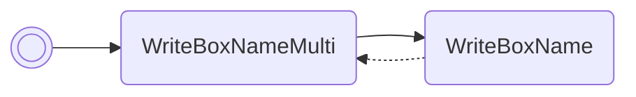

# Read raw data

Prints the raw data making up the Pokémon in box 1, slot 1. The data is printed
10 32-bit words at a time. If unmarked, the first 10 words will be printed. If
marked, the second 10 words will be.

/// pokemon | Claydol ["ReadPkData"]
    open: true

//// tab | :octicons-cpu-24: ARM assembly
``` { .arm_v4 .annotate linenums="1" }
03 98           LDR     r0, sp.gPokemonStorage
79 46           CPY     r1, pc
49 7D           LDRB    r1, [r1, #21]
05 E0           B       #14
CC D9 D5 D8     .byte   "Read"
CA DF BE D5     .byte   "PkDa"
E8 D5 02 02     .byte   "ta", #0x02, #0x02
00 29           CMP     r1, #0
04 D0           BEQ     ?
02 D1           BNE     ?
00 00
1A E7
00 00
28 30           ADD     r0, #20
04 30           ADD     r0, #4
01 21           MOV     r1, #1
89 02           LSL     r1, r1, #10
01 39           SUB     r1, #1
00 E0           B       #4
75 E4
0A 22           MOV     r2, #10
08 9B           LDR     r3, sp.WriteBoxNameMulti
9E 46           CPY     lr, r3
00 F8           BL      lr
00 20           MOV     r0, #0
0A E0           B       nextFreeBoxSlot
00 00
00 00 00 00
00 00 00 00
00 00 00 00
00 00 00 00
00 00 00 00
```
////

//// tab | :octicons-list-unordered-24: Box code
```box_code
Box  1: A5 h5 Rk l9
Box  2: Be DM 2d XY
Box  3: yt !! 1e jV
Box  4: Ag IA KQ TQ
Box  5: At EA AB rn
Box  6: AA Ao MA Qw
Box  7: AS GJ Ag E5
Box  8: AO B1 5A oi
Box  9: CJ ue Rg D4
Box 10: AC AK 4A AA
```
////

//// tab | :octicons-apps-24: PokeGlitzer
``` { .text .copy }
03 98 79 46   49 7D 05 E0
CC D9 D5 D8   CA DF BE D5
E8 D5 02 02   00 29 04 D0
02 D1 00 00   1A E7 00 00
28 30 04 30   01 21 89 02
01 39 00 E0   75 E4 0A 22
08 9B 9E 46   00 F8 00 20
0A E0 00 00   00 00 00 00
00 00 00 00   00 00 00 00
00 00 00 00   00 00 00 00
```
////

//// tab | :octicons-arrow-switch-24: Signature

///// html | div.signature-typed
+-----------+---------------+-----------------------------------+
| OUT       | Type          | Function                          |
+===========+===============+===================================+
| `BOX1`    | `Hexadecimal` | Pokémon data structure, word #1   |
+-----------+---------------+-----------------------------------+
| `BOX2`    | `Hexadecimal` | Pokémon data structure, word #2   |
+-----------+---------------+-----------------------------------+
| `BOX3`    | `Hexadecimal` | Pokémon data structure, word #3   |
+-----------+---------------+-----------------------------------+
| `BOX4`    | `Hexadecimal` | Pokémon data structure, word #4   |
+-----------+---------------+-----------------------------------+
| `BOX5`    | `Hexadecimal` | Pokémon data structure, word #5   |
+-----------+---------------+-----------------------------------+
| `BOX6`    | `Hexadecimal` | Pokémon data structure, word #6   |
+-----------+---------------+-----------------------------------+
| `BOX7`    | `Hexadecimal` | Pokémon data structure, word #7   |
+-----------+---------------+-----------------------------------+
| `BOX8`    | `Hexadecimal` | Pokémon data structure, word #8   |
+-----------+---------------+-----------------------------------+
| `BOX9`    | `Hexadecimal` | Pokémon data structure, word #9   |
+-----------+---------------+-----------------------------------+
| `BOX10`   | `Hexadecimal` | Pokémon data structure, word #10  |
+-----------+---------------+-----------------------------------+
/////

////

//// tab | :octicons-star-fill-24: Markings

///// html | div.markings
+-------------------------------+-----------------------------------+
| Marking                       | Function                          |
+===============================+===================================+
| :material-star-outline:       | Print first half of Pokémon data  |
|                               | structure                         |
+-------------------------------+-----------------------------------+
| :material-star:               | Print second half of Pokémon data |
|                               | structure                         |
+-------------------------------+-----------------------------------+
/////

////

//// tab | :octicons-package-dependencies-24: Dependencies

////

///
