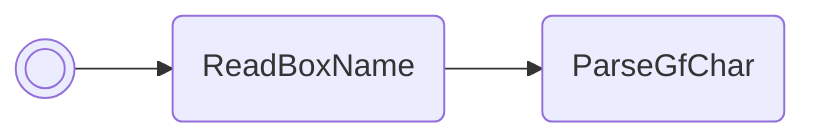

# Teach single move

Teaches a single move to the Pokémon in box 1, slot 1. If said Pokémon already
knows 4 moves, the move in slot 1 will be deleted first, similar to how moves
are learnt/replaced while in the daycare.

/// pokemon | Kecleon ["TeachMove"]
    open: true

//// tab | :octicons-cpu-24: ARM assembly
``` { .arm_v4 .annotate linenums="1" }
00 20           MOV     r0, #0
00 46           NOP
01 21           MOV     r1, #1
05 E0           B       #14
CE D9 D5 D7     .byte   "Teac"
DC C7 E3 EA     .byte   "hMov"
D9 FF 02 02     .byte   "e", #0xFF, #0x02, #0x02
05 9A           LDR     r2, sp.ReadBoxName
96 46           CPY     lr, r2
00 F8           BL      lr
02 E0           B       #8
EA 6F
00 00
3C 00
01 46           CPY     r1, r0
03 98           LDR     r0, sp.gPokemonStorage
04 30           ADD     r0, #4
03 4A           LDR     r2, DeleteFirstMoveAndGiveMoveToBoxMon
96 46           CPY     lr, r2
00 F8           BL      lr
00 20           MOV     r0, #0
0E E0           B       nextFreeBoxSlot
00 00
00 00 00 00

                DeleteFirstMoveAndGiveMoveToBoxMon:
D1 94 06 08     .word   #0x080694D1
00 00 00 00
00 00 00 00
00 00 00 00
00 00 00 00
00 00 00 00
```
////

//// tab | :octicons-list-unordered-24: Box code

///// tab | Emerald
```box_code
Box  1: AC AA Rg Eh
Box  2: Be DO 2d XX
Box  3: 3M fj 6t n?
Box  4: Ag IF mp ZG
Box  5: AP gC 4O pv
Box  6: AA A8 AA FG
Box  7: A5 gE MA NK
Box  8: lk YA !A Ag
Box  9: Du AA AA AA
Box 10: AA DR lA YI
Box 11: 00 oo OO YI
```
/////

///// tab | FireRed v1.0
```box_code
```
/////

///// tab | FireRed v1.1
```box_code
```
/////

////

//// tab | :octicons-apps-24: PokeGlitzer

///// tab | Emerald
``` { .text .copy }
00 20 00 46   01 21 05 E0
CE D9 D5 D7   DC C7 E3 EA
D9 FF 02 02   05 9A 96 46
00 F8 02 E0   EA 6F 00 00
3C 00 01 46   03 98 04 30
03 4A 96 46   00 F8 00 20
0E E0 00 00   00 00 00 00
D1 94 06 08   00 00 00 00
00 00 00 00   00 00 00 00
00 00 00 00   00 00 00 00
```
/////

///// tab | FireRed v1.0
``` { .text .copy }
```
/////

///// tab | FireRed v1.1
``` { .text .copy }
```
/////

////

//// tab | :octicons-arrow-switch-24: Signature

///// html | div.signature-typed
+-----------+---------------+-----------------------+
| IN        | Type          | Function              |
+===========+===============+=======================+
| `BOX1`    | `Hexadecimal` | ID of move to teach   |
+-----------+---------------+-----------------------+
/////

////

//// tab | :octicons-package-dependencies-24: Dependencies

////

///
