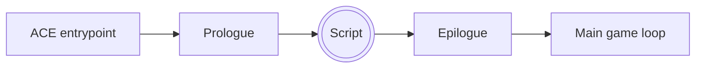

# Bootstrapping our environment

Now that we've discussed the what, let's talk a little about the how. Obviously,
the environment I've proposed is going to require a bunch of scaffolding around
it to actually work. So what does this environment actually _look_ like?

The environment is going to consist of two parts:

1.  The _script execution area_. Unlike most basic ACE environments where the
    program counter lands somewhere in the PC and runs wild until it hits an
    exit code, we're going to delineate a very specific part of our PC as
    executable. When we want to execute a script, we'll need to move the Pokémon
    making up that script into this area before triggering ACE. If ACE is
    triggered and this area is empty, nothing will happen
2.  The _function library_. This is an area of the PC where we'll keep reusable
    subroutines that can be called by our scripts that will handle common tasks
    like reading parameters from box names. Unfortunately, ASLR means that their
    addresses will be unpredictable, so we'll instead make them
    available to our scripts by pushing their addresses to the stack. For
    instance, if you specify that your function library starts at box 3, slot 7
    and contains 4 functions, then the stack will contain the addresses[^1] of
    slot 7, then slot 8, then slot 9, & then slot 10, in that order

All of this will be be managed by a set of bootstraps. These bootstraps will be
split into two groups: the _prologue_ & the _epilogue_. If you're not familiar
with the terms, "prologue" & "epilogue" are used in assembly programming to
refer to blocks of instructions that bracket the main body of a function, and
are responsible for managing the state of that function's stack frame. The
prologue will generally handle things like storing callee-saved registers &
allocating stack space for local variables, while the epilogue will restore
those registers, deallocate any memory, & finally return control to the caller.

Our prologue & epilogue will similarly bookend our script, though their
responsibilities will be much more intricate. The flow of control we'll
establish will look like this:



Our prologue will consist of 2 Pokémon, an Altaria & a Dragonair. Our epilogue
will be a single Ampharos. Below we'll go into detail on the responsibilities of
each.

## The prologue

The prologue should be placed shortly after the ACE entrypoint, and will take
control of the wayward program counter and lay the foundation for our
environment.

--8<-- "bootstraps/altaria.md"

--8<-- "bootstraps/dragonair.md"

Let's go over what's happening here step-by-step:

1.  Our very first line, described here as `NOP`, is actually a Thumb-to-ARM
    gate[^2]. This only acts as a no-op when run in ARM mode; in Thumb mode, it will
    switch to ARM mode and jump to the next instruction. Now we've harmonized
    around a single execution mode
2.  We push all of our registers other than `sp` & `lr` to the stack. When we
    return to the main game loop, we're going to need these registers to contain
    the values they had when ACE was first triggered. Storing them in this way
    also allows us to make use of all registers during script execution
3.  We prepare to jump to some Thumb code by manually calculating a
    `pc`‑relative offset, but note that we also clear the second least
    significant bit. This is so that we can ensure that our `pc` is aligned[^3]
4.  We determine the size of our function library and allocate enough space on
    the stack for the addresses of that many functions, plus 4 extra slots
5.  We derefence the global pointers to all 3 ASLR-affected data structures[^4]
    & store their addresses on the stack. We also store the old value of `sp`
    on the stack, too[^5]
6.  We jump to the function library and store the address of each slot in it to
    the stack. We skip over any slot that contains a Pokémon with the PID
    `0xFFFFFFF5`[^6]
8.  Lastly, we calculate the address of our script execution area & branch to
    it. If Altaria is marked, we branch to it in ARM mode; otherwise, we stay in
    Thumb mode

There are certain bytes in Altaria in particular that are data, not code. These
are constant values, and can be changed if you want to reorganize things. These
values & their default values are listed below:

+---------------+-----------------------------------------------------------+
| Variable      | Function                                                  |
+===============+===========================================================+
| `libraryBox`  | Function library location (box index, 0–13)               |
+---------------+-----------------------------------------------------------+
| `librarySlot` | Function library location (slot index, 0–29)              |
+---------------+-----------------------------------------------------------+
| `librarySize` | Function library size                                     |
+---------------+-----------------------------------------------------------+
| `scriptBox`   | Script execution area location (box index, 0–13)          |
+---------------+-----------------------------------------------------------+
| `scriptSlot`  | Script execution area location (slot index, 0–29)         |
+---------------+-----------------------------------------------------------+

I wouldn't recommend altering these values unless you really know what you're
doing.

## The epilogue

The epilogue is shorter than the prologue, but a bit denser. There are also
significant differences between the Emerald epilogue & the FR/LG epilogue. This
is because, as mentioned, I'm assuming the method of triggering ACE varies
between the two sets of game: glitch animation ACE for Emerald, & swap/grab ACE
for FR/LG. Each requires some special handling in the epilogue.

--8<-- "bootstraps/ampharos.md"

The most important thing about the epilogue to understand is that it interprets
the value of `r0` it gets from the script as an _exit code_, similar to the
`main` function in a C program. If the value of `r0` is `0`, the script was
successful. Any other value indicates failure. The way the epilogue conveys this
information to the player is via a sound effect. If the script was successful,
it will play `SE_SUCCESS`. If not, it will play `SE_FAILURE`.

On Emerald, it will also call the ROM function `StopCryAndClearCrySongs`. This
function, as you might expect, prevents the glitch Pokémon's cry from playing on
the summary screen. This is only done to make it easier to hear the exit code
sound effect. More importantly, however, we set the value of the glitch
Pokémon's sprite's `inUse` flag to `0`. This is a technique originally developed
by Mettrich, and allows us to stay on the summary screen after triggering ACE.
This completely obviates the need for a traditional ACE exit strategy, like
opening the diploma completion screen.

FR/LG is even more complicated. A common side-effect of grab/swap ACE is the
generation of bad eggs, often invisible, in the area just after the ACE
entrypoint. This is because trigger grab/swap ACE causes a pointer called
`markingComboSprite` in `gStorage` to be overwritten with the same address that
we jump to in `gPokemonStorage`. When this sprite's `invisible` flag is
modified, bad eggs result. By restoring the correct value of
`markingComboSprite` before this can happen, we prevent any egg generation. This
technique was developed by Adrichu00.

The final step in both games is to restore our previously-stashed register
values, and then return control back to the main game loop via `BX lr`. In FR/LG
we also make sure `r0` contains `0` as a return value.

## Next steps

Go ahead and create all 3 bootstraps, but set them aside for now. It's possible
to setup our environment now, yes, but there's one more thing we need to do
first: replace the hex writer.

[^1]:
    Actually, it will contain their addresses + 1. This is because the
    environment assumes all library functions are written in Thumb, and by
    setting the least significant bit of an address to `1`, you can jump to it
    in Thumb mode using the `BX` instruction. If you really want to write a
    library function in ARM, you'll need to prefix it with a Thumb-to-ARM gate

[^2]:
    The Thumb-to-ARM gate is actually executed thusly:

    ```arm_v4
    @ ARM
    78 47 02 F0     ANDNV   r4, r2, r8, ROR r7

    @ Thumb
    78 47           BX      pc
    02 F0           @ Branched over entirely
    ```

    The 3rd byte, `0x02`, can be anything, and is generally changed to manage
    the substructure order of the Pokémon that starts with it.

    The `NV` ARM condition suffix is what's important here: it stands for
    "NeVer", and prevents the execution of the instruction regardless of the
    state of the `cpsr`. Many online resources will tell you that this is a
    deprecated feature on the GBA's ARMv4T CPU, which it _technically_ is.
    However, I can confirm that it does still work, which means we can turn
    _any_ ARM instruction into a no-op!

[^3]:
    Program counter misalignment is typical when using box code payloads, but
    I see no reason to misalign the `pc` register outside of that. It doesn't
    affect execution, but it _can_ cause trouble with `pc`-relative calculations
    if you aren't careful

[^4]:
    These structures are `gSaveBlock1`, `gSaveBlock2`, & `gPokemonStorage`. The
    global pointers to them are stored consecutively in memory, which means it's
    actually possible to dereference all 3 with just 2 instructions:

    ```arm_v4
    ADR     r1, gSaveBlock1Ptr
    LDMIA   r1, { r1-r3 }
    ```

    By doing this, and storing them on the stack for our scripts, we can
    more-or-less completely ignore the existance of ASLR. It also means we can
    calculate important ASLR-affected addresses in a `pc`-neutral manner,
    meaning that our scripts can be executed from anywhere in the PC without
    breaking functionality

[^5]:
    We store the old value of `sp` not so that we can use it in our scripts, but
    because it makes returning the stack to its pre-ACE state much easier.
    Deallocating all the stack space we reserved for our environment is as
    simple as:

    ```arm_v4
    POP     { r0 }
    CPY     sp r0
    ```

    Without this value, we would need to either keep track of how many items we
    pushed to the stack, hard code it somewhere, or use a terminator value of
    some sort. None of these options are as elegant as above

[^6]:
    The reason I do this is to allow the possibility of multi-Pokémon library
    scripts where only the first Pokémon's address is stored. This keeps the
    stack state simple. This is a feature I've yet to take advantage of, but I
    can see it being handy in the future
