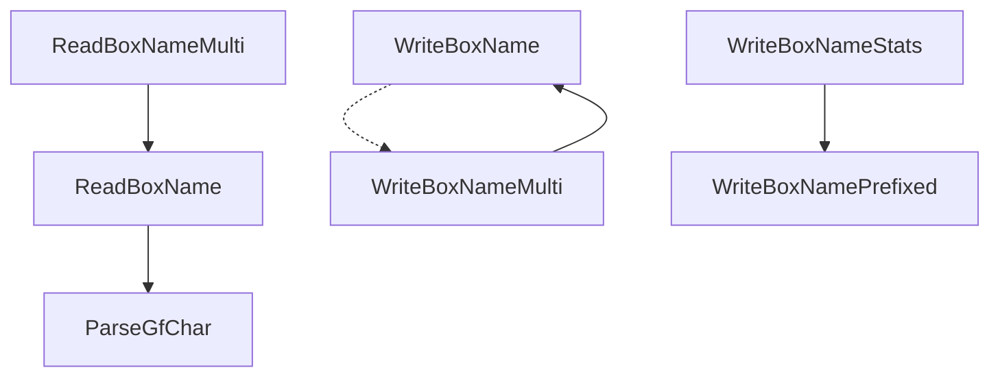

# Function library

Now that we can create glitch Pokémon with ease, it's time to talk about the
function library. The function library, as discussed before, is defined by a
PC box slot, which determines where the prologue starts looking for functions,
and a size, which determines how many function addresses the prologue adds to
the stack.

The most important thing to keep in mind here is that the prologue will push
functions to the stack starting from the _end_ of the function library. Because
the stack is a last-in-first-out data structure, this means that adding new
functions to the library will not disrupt the stack position of previously
existing functions. The instruction `LDR r0, [sp, #20]` will _always_ return
the adress of our box name parsing function, regardless of what comes after it.

The currently library contains just 7 functions, all of which you'll find on
this page.

/// html | div.grid[markdown]

{ width="300" }
//// caption
A full library on Emerald version
////

///

## Dependency diagram

This diagram shows the dependencies between the functions in the library, with
an arrow from A to B meaning "A calls B". The dotted arrow from `WriteBoxName`
to `WriteBoxNameMulti` does not mean the former calls the latter, though;
rather, `WriteBoxName` reads a ROM address stored `WriteBoxNameMulti` due to
space constraints. It's still a dependency, just a different type of dependency.



The library does not need to be totally completed for scripts to function. Each
script will only ever interact with the functions listed its dependencies tab.
For instance, if a script you want to use only calls `ReadBoxName`, then only
`ReadBoxName` & `ParseGfChar` actually need to be present in your library for
you to use it. This means you can build your library up in a piecemeal fashion,
only adding functions as the scripts you use call for them.

If you're not going to create one of the functions, make sure its slot stays
blank! Positioning within the library is absolute, and shifting things forward
or backward will cause crashes.

## Functions

### `ParseGfChar`

Prior to generation 4, the core series Pokémon games used proprietary character
encodings rather than the UTF-16 of latter generations. Both the Japanese &
non-Japanese encodings for generation 3 can be found on [Bulbapedia](
https://bulbapedia.bulbagarden.net/wiki/Character_encoding_(Generation_III)).

A common task our scripts need to perform is reading these encoded strings as
integers. This function is foundational to doing so: it takes in a single
character and returns it's value as an integer. For instance, if given the byte
`0xA8`, which corresponds to the character `7`, it will return the value `0x07`.
It also takes in a second parameter which specifies the numeric base to parse in
(either decimal or hexadecimal).

If given an invalid character, this function will return `-1`.

--8<-- "library/pikachu.md"

### `ReadBoxName`

This is our most important function: it take in a box index & a numeric base,
and returns the value of the requested box's name parsed in said base. Invalid
characters are ignored as if they do not exist.

--8<-- "library/eevee.md"

### `ReadBoxNameMulti`

This function works the same as the Eevee above, but allows multiple box names
to be parsed at once. The numeric base used for parsing can be specified on a
per-box basis using a packed bit array: if bit X of `r1` is `0`, then box name
X+1 will be parsed in decimal; if it's instead `1`, it will be parsed in
hexadecimal.

--8<-- "library/vaporeon.md"

### `WriteBoxName`

This function writes a value to a box name, either in decimal or hexadecimal.

--8<-- "library/jolteon.md"

### `WriteBoxNameMulti`

Functions similarly to `ReadBoxNameMulti`, though it instead writes box names
via `WriteBoxName`. It uses the same packed bit array to specify numeric bases.

--8<-- "library/flareon.md"

### `WriteBoxNamePrefixed`

This function is _mostly_ just used by `WriteBoxNameStats`, but has other uses
too. It prints a value as a decimal integer, but also prefixes a 3 character
string to the front of it. An example might be something like `ABC 5`.

--8<-- "library/espeon.md"

### `WriteBoxNameStats`

This function takes in an array of 6 values, and prints them to the first 6
box names as decimal integers. These 6 values are meant to be Pokémon
stat-related, and each will be prefixed with an abbreviation for its respective
stat.

If the array passed in contains `[12, 8, 3, 0, 44, 129]`, the box names would
be `HP  12`, `Atk 8`, `Def 3`, `Spe 0`, `SpA 44`, & `SpD 129`. Not that speed
comes between defense & special attack, not at the end.

--8<-- "library/umbreon.md"

## Stack state

Once the prologue runs and calls our script, this is what our stack will look
like:

/// html | div.data-table
+---------------+-----------------------------------+
| Stack offset  | Value/address                     |
+===============+===================================+
| `[sp, #0]`    | Prior value of the stack pointer  |
+---------------+-----------------------------------+
| `[sp, #4]`    | `gSaveBlock1`                     |
+---------------+-----------------------------------+
| `[sp, #8]`    | `gSaveBlock2`                     |
+---------------+-----------------------------------+
| `[sp, #12]`   | `gPokemonStorage`                 |
+---------------+-----------------------------------+
| `[sp, #16]`   | `ParseGfChar`                     |
+---------------+-----------------------------------+
| `[sp, #20]`   | `ReadBoxName`                     |
+---------------+-----------------------------------+
| `[sp, #24]`   | `ReadBoxNameMulti`                |
+---------------+-----------------------------------+
| `[sp, #28]`   | `WriteBoxName`                    |
+---------------+-----------------------------------+
| `[sp, #32]`   | `WriteBoxNameMulti`               |
+---------------+-----------------------------------+
| `[sp, #36]`   | `WriteBoxNamePrefixed`            |
+---------------+-----------------------------------+
| `[sp, #40]`   | `WriteBoxNameStats`               |
+---------------+-----------------------------------+
///

If you want to make use of one of the functions, you can use `LDR` to load its
address into a register. For instance, say you want to parse box 1's name as
hexadecimal. Doing so is simple:

/// html | div.pseudo-admonition
```arm_v4
MOV     r0, #0
MOV     r1, #1
LDR     r2, [sp, #20]
CPY     lr, r2
BL      lr
```
///

Ignoring the setting of the parameters, that's just 3 Thumb instructions per
function call!

Remember that any modifications made to the stack during script execution should
be undone before control is passed to the epilogue. Failure to do so will result
in a crash.
