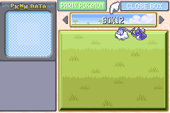
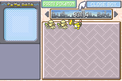
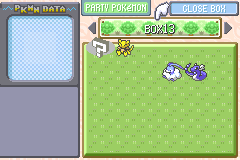
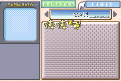

# Replacing the hex writer

With our bootstraps created, we're very nearly to the point where we can start
using scripts. Unfortunately, there's one major problem we need to address
before moving forward: once we replace our old bootstraps with our new ones, our
hex writer will cease to function. We _could_ swap between the two sets if
necessary, but that's obviously not ideal.

Instead, we're going to replace the hex writer entirely with a script that can
take over its duties. In fact, we're going to capitalize on this replacement and
start encoding our data in base 64 rather than hexadecimal.

## The base 64 writer

Firstly, I should mention that the idea for a base 64 box name writer is not
mine. The idea comes from [Mettrich](
https://gist.github.com/claydolwithexplosion/017f1784deebcd118b61d3ad917edb3c),
also known as claydolwithexplosion. This script is merely a translation of his
into a format compatible with my bootstraps.

My version of the base 64 writer does differ a _bit_ from his, though. You'll
notice I've yet to say anything about a crafting table. This is because my data
writer doesn't actually rely on one. Instead, it writes to the first empty slot
it finds in box 1 of the PC, similar to how a wild Pokémon might be deposited
after being caught with a full party.

All that being said, you might be wondering _why_ we'd use base 64 instead of
hexadecimal. The reason is _density_. Each box name contains 8 characters, and
a single hexadecimal digit encodes 4 bits, meaning that each box name is 4
bytes worth of data. With 14 box names, this means each full box code results in
56 bytes being written to the destination address. This is a major problem,
though, as the Pokémon data structure is 80 bytes long. Writing Pokémon in 2
stages is tricky, too, as viewing a partially-written glitch Pokémon will result
in it being corrupted into a bad egg.

Base 64 solves this entirely: a base 64 character encodes 6 bits, meaning that
each box name is 6 bytes, and a full set of 14 box names is 84 bytes. This means
you'll never need more than one box code to create a Pokémon! This is what
allows us to avoid the crafting table, by the way—without the possiblity of
partially-written Pokémon, there's no reason to isolate them away from the
prying eyes of the `CalculateBoxMonChecksum` function.

Let's go ahead and take a look at the script:

--8<-- "scripts/smeargle-a.md"

--8<-- "scripts/smeargle-b.md"

These will be the last admonitions in this tutorial that make use of hexadecimal
box codes. Henceforth, all codes will be in base 64. Which means this script
really isn't optional.

## Script execution

Congrats, you've created your first script! Not only that, but we can finally
leave our old environment behind and start using all the bootstraps we created.
Below, you'll find images showing how you should position Altaria, Dragonair,
Ampharos, & the 2 Smeargles.

/// tab | Emerald

//// html | div.grid[markdown]

{ width="300" }
///// caption
Box 12
/////

{ width="300" }
///// caption
Box 14
/////

////

///

/// tab | FireRed/LeafGreen

//// html | div.grid[markdown]

{ width="300" }
///// caption
Box 13
/////

{ width="300" }
///// caption
Box 14
/////

////

///

Note that multi-Pokémon scripts like our 2 Smeargles here **cannot** have gaps
between them. They _must_ be placed in consecutive box slots. You can leave a
gap between the script & the epilogue if you wish, however. I typically leave
Ampharos in slot 6, for instance, which means I can drop scripts up to 5 Pokémon
long into the execution area without having to move it around.

At this point, triggering ACE will cause the base 64 writer to run. Just to make
sure everything's working correctly, let's go ahead try out a box code:

/// html | div.pseudo-admonition
```box_code
Box  1: qZ FQ 6P ??
Box  2: Bo bN 2e Tp
Box  3: 4O jp 5t X?
Box  4: Ag LF 6t 3n
Box  5: 6P 8A AO ji
Box  6: AA BW bl Zu
Box  7: Vm 5W bl Zu
Box  8: Vm 5W Nl NM
Box  9: qZ Gp UV Zu
Box 10: Vm 5c bn tu
Box 11: Vm 5W bn VG
Box 12: Vm 5S bl Zu
Box 13: 0W 5W bl Zu
Box 14: Vm 4A AA AA
```
///

Make sure Altaria is unmarked, trigger ACE, and check box 1. You should
hopefully see a shiny level 5 Charmander named "Sepultura".

/// warning | Base 64 writer failure
While the base 64 writer will look for the first empty slot in box 1 to write
your box code to, it will **not** search any further. If box 1 is full, the
script will fail
///

## Optional: creating a fast (de)cloner

This is far from necessary for this tutorial, but if you don't have one, now
might be a good time to create a fast cloner/decloner species. If you're not
familiar with how these decamarks work, Sleipnir17 has a [fantastic video](
https://www.youtube.com/watch?v=Sa9nEZBU3DI) going over the glitch in detail.

/// tab | Emerald

//// html | div.pseudo-admonition
```box_code
; Creates species 0x2600
Box  1: AA AA AA AA
Box  2: AA AA AA AA
Box  3: AA AA AA AA
Box  4: AA IA AA AA
Box  5: AA AA AA Ao
Box  6: AA AA KA AA
```
////

///

/// tab | FireRed/LeafGreen

//// html | div.pseudo-admonition
```box_code
; Creates species 0x3200
Box  1: AA AA AA AA
Box  2: AA AA AA AA
Box  3: AA AA AA AA
Box  4: AA IA AA AA
Box  5: AA AA AA Ay
Box  6: AA AA Mg AA
```
////

///
