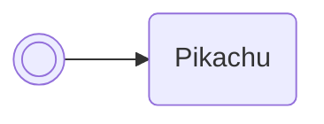

/// pokemon | Eevee

//// tab | :octicons-cpu-24: ARM assembly
``` { .arm_v4 .annotate linenums="1" }
F2 B5           PUSH    { r1, r4-r7, lr }
0E 49           LDR     r1, GetBoxNamePtr
8E 46           CPY     lr, r1
00 F8           BL      lr
10 BC           POP     { r4 }
05 46           CPY     r5, r0
00 26           MOV     r6, #0
00 27           MOV     r7, #0

                charLoop:
A8 5D           LDRB    r0, [r5, r6]
01 42           NOP
FF 28           CMP     r0, #0xFF
17 D0           BEQ     return
21 46           CPY     r1, r4
00 E0           B       #4
3F BC
FF F7 C7 FF     BL      pikachu
41 1C           ADD     r1, r0, #1
08 D0           BEQ     charLoopCoda
00 2C           CMP     r4, #0
01 D0           BEQ     readAsDecimal
03 D1           BNE     readAsHexadecimal
F9 F3

                readAsDecimal:
0A 21           MOV     r1, #10
4F 43           MUL     r7, r1
00 E0           B       addDigit

                readAsHexadecimal:
3F 01           LSL     r7, r7, #4

                addDigit:
3F 18           ADD     r7, r7, r0

                charLoopCoda:
01 36           ADD     r6, #1
03 E0           B       #10

                GetBoxNamePtr:
D1 20 0D 08     .word   #0x080D20D1
00 00
00 00
08 2E           CMP     r6, #8
E3 D3           BLO     charLoop

                return:
38 46           CPY     r0, r7
F0 BC           POP     { r4-r7 }
02 BC           POP     { r1 }
08 47           BX      r1
```
////

//// tab | :octicons-list-unordered-24: Box code

///// tab | Emerald
```box_code
Box  1: 8r UO SY 5G
Box  2: AP gQ vA VG
Box  3: AC YA J6 hd
Box  4: AU L? KB fQ
Box  5: IU YA 4D !8
Box  6: ?? fH ?0 Ec
Box  7: CN AA LA HQ
Box  8: A9 H5 8w oh
Box  9: T0 MA 4D 8B
Box 10: Px gB Ng Pg
Box 11: 0S AN CA AA
Box 12: AA AI Lu PT
Box 13: OE bw vA K8
Box 14: CE cA AA AA
```
/////

///// tab | FireRed v1.0
```box_code
Box  1: 8r UO SY 5G
Box  2: AP gQ vA VG
Box  3: AC YA J6 hd
Box  4: AU L? KB fQ
Box  5: IU YA 4K Y2
Box  6: ?? fH ?0 Ec
Box  7: CN AA LA HQ
Box  8: A9 H5 8w oh
Box  9: T0 MA 4D 8B
Box 10: Px gB Ng Pg
Box 11: bb 0I CA AA
Box 12: AA AI Lu PT
Box 13: OE bw vA K8
Box 14: CE cA AA AA
```
/////

///// tab | FireRed v1.1
```box_code
Box  1: 8r UO SY 5G
Box  2: AP gQ vA VG
Box  3: AC YA J6 hd
Box  4: AU L? KB fQ
Box  5: IU YA 4J I3
Box  6: ?? fH ?0 Ec
Box  7: CN AA LA HQ
Box  8: A9 H5 8w oh
Box  9: T0 MA 4D 8B
Box 10: Px gB Ng Pg
Box 11: gb 0I CA AA
Box 12: AA AI Lu PT
Box 13: OE bw vA K8
Box 14: CE cA AA AA
```
/////

///// tab | LeafGreen v1.0
```box_code
Box  1: 8r UO SY 5G
Box  2: AP gQ vA VG
Box  3: AC YA J6 hd
Box  4: AU L? KB fQ
Box  5: IU YA 4N I2
Box  6: ?? fH ?0 Ec
Box  7: CN AA LA HQ
Box  8: A9 H5 8w oh
Box  9: T0 MA 4D 8B
Box 10: Px gB Ng Pg
Box 11: Qb 0I CA AA
Box 12: AA AI Lu PT
Box 13: OE bw vA K8
Box 14: CE cA AA AA
```
/////

///// tab | LeafGreen v1.1
```box_code
Box  1: 8r UO SY 5G
Box  2: AP gQ vA VG
Box  3: AC YA J6 hd
Box  4: AU L? KB fQ
Box  5: IU YA 4L 42
Box  6: ?? fH ?0 Ec
Box  7: CN AA LA HQ
Box  8: A9 H5 8w oh
Box  9: T0 MA 4D 8B
Box 10: Px gB Ng Pg
Box 11: Vb 0I CA AA
Box 12: AA AI Lu PT
Box 13: OE bw vA K8
Box 14: CE cA AA AA
```
/////

////

//// tab | :octicons-apps-24: PokeGlitzer

///// tab | Emerald
``` { .text .copy }
F2 B5 0E 49   8E 46 00 F8
10 BC 05 46   00 26 00 27
A8 5D 01 42   FF 28 17 D0
21 46 00 E0   3F BC FF F7
C7 FF 41 1C   08 D0 00 2C
01 D0 03 D1   F9 F3 0A 21
4F 43 00 E0   3F 01 3F 18
01 36 03 E0   D1 20 0D 08
00 00 00 00   08 2E E3 D3
38 46 F0 BC   02 BC 08 47
```
/////

///// tab | FireRed v1.0
``` { .text .copy }
F2 B5 0E 49   8E 46 00 F8
10 BC 05 46   00 26 00 27
A8 5D 01 42   FF 28 17 D0
21 46 00 E0   A6 36 FF F7
C7 FF 41 1C   08 D0 00 2C
01 D0 03 D1   F9 F3 0A 21
4F 43 00 E0   3F 01 3F 18
01 36 03 E0   6D BD 08 08
00 00 00 00   08 2E E3 D3
38 46 F0 BC   02 BC 08 47
```
/////

///// tab | FireRed v1.1
``` { .text .copy }
F2 B5 0E 49   8E 46 00 F8
10 BC 05 46   00 26 00 27
A8 5D 01 42   FF 28 17 D0
21 46 00 E0   92 37 FF F7
C7 FF 41 1C   08 D0 00 2C
01 D0 03 D1   F9 F3 0A 21
4F 43 00 E0   3F 01 3F 18
01 36 03 E0   81 BD 08 08
00 00 00 00   08 2E E3 D3
38 46 F0 BC   02 BC 08 47
```
/////

///// tab | LeafGreen v1.0
``` { .text .copy }
F2 B5 0E 49   8E 46 00 F8
10 BC 05 46   00 26 00 27
A8 5D 01 42   FF 28 17 D0
21 46 00 E0   D2 36 FF F7
C7 FF 41 1C   08 D0 00 2C
01 D0 03 D1   F9 F3 0A 21
4F 43 00 E0   3F 01 3F 18
01 36 03 E0   41 BD 08 08
00 00 00 00   08 2E E3 D3
38 46 F0 BC   02 BC 08 47
```
/////

///// tab | LeafGreen v1.1
``` { .text .copy }
F2 B5 0E 49   8E 46 00 F8
10 BC 05 46   00 26 00 27
A8 5D 01 42   FF 28 17 D0
21 46 00 E0   BE 36 FF F7
C7 FF 41 1C   08 D0 00 2C
01 D0 03 D1   F9 F3 0A 21
4F 43 00 E0   3F 01 3F 18
01 36 03 E0   55 BD 08 08
00 00 00 00   08 2E E3 D3
38 46 F0 BC   02 BC 08 47
```
/////

////

//// tab | :octicons-arrow-switch-24: Signature

///// html | div.signature
+-------+-----------------------------------+
| IN    | Function                          |
+=======+===================================+
| `r0`  | Box name index (indexed from 0)   |
+-------+-----------------------------------+
| `r1`  | Numeric base:                     |
|       |                                   |
|       | - `0x00` – Decimal                |
|       | - `0x01` – Hexadecimal            |
+-------+-----------------------------------+
/////

///// html | div.signature
+-------+---------------------------------------------------+
| OUT   | Function                                          |
+=======+===================================================+
| `r0`  | Integer value of the box name, parsed as per `r1` |
+-------+---------------------------------------------------+
/////

////

//// tab | :octicons-package-dependencies-24: Dependencies

////

///
