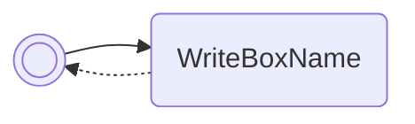

/// pokemon | Flareon

//// tab | :octicons-cpu-24: ARM assembly
``` { .arm_v4 .annotate linenums="1" }
1B 46           NOP
F7 B5           PUSH    { r0-r2, r4-r7, lr }
70 BC           POP     { r4-r6 }
00 27           MOV     r7, #0

                boxLoop:
BE 42           CMP     r6, r7
0D D9           BLS     return
38 46           CPY     r0, r7
01 21           MOV     r1, #1
29 40           AND     r1, r5
01 42           NOP
04 CC           LDMIA   r4!, { r2 }
FF F7 CB FF     BL      jolteon
02 E0           B       #8
38 7B
00 00
E3 FA
6D 08           LSR     r5, r5, #1
01 37           ADD     r7, #1
EF E7           B       boxLoop

                return:
F0 BC           POP     { r4-r7 }
01 BC           POP     { r0 }
00 47           BX      r0
00 00

                GetBoxNamePtr:
D1 20 0D 08     .word   #0x080D20D1

                ConvertIntToDecimalStringN:
C1 8C 00 08     .word   #0x08008CC1
00 00 00 00
00 00 00 00
00 00 00 00
00 00 00 00
00 00 00 00
00 00 00 00
```
////

//// tab | :octicons-list-unordered-24: Box code

///// tab | Emerald
```box_code
Box  1: G0 b3 tX C8
Box  2: AC e! Qg 3Z
Box  3: OE YB IS lA
Box  4: AU IE zP ?3
Box  5: y? 8C 4D h7
Box  6: AA Dj !m 0I
Box  7: AT fv 5? C8
Box  8: Ab wA Rw AA
Box  9: 0S AN CM GM
Box 10: AA gA AA AA
```
/////

///// tab | FireRed v1.0
```box_code
Box  1: G0 b3 tX C8
Box  2: AC e! Qg 3Z
Box  3: OE YB IS lA
Box  4: AU IE zP ?3
Box  5: y? 8C 4P Hk
Box  6: AA Dj !m 0I
Box  7: AT fv 5? C8
Box  8: Ab wA Rw AA
Box  9: bb 0I CH mO
Box 10: AA gA AA AA
```
/////

///// tab | FireRed v1.1
```box_code
Box  1: G0 b3 tX C8
Box  2: AC e! Qg 3Z
Box  3: OE YB IS lA
Box  4: AU IE zP ?3
Box  5: y? 8C 4K nm
Box  6: AA Dj !m 0I
Box  7: AT fv 5? C8
Box  8: Ab wA Rw AA
Box  9: gb 0I CI 2O
Box 10: AA gA AA AA
```
/////

///// tab | LeafGreen v1.0
```box_code
Box  1: G0 b3 tX C8
Box  2: AC e! Qg 3Z
Box  3: OE YB IS lA
Box  4: AU IE zP ?3
Box  5: y? 8C 4B Xl
Box  6: AA Dj !m 0I
Box  7: AT fv 5? C8
Box  8: Ab wA Rw AA
Box  9: Qb 0I CH mO
Box 10: AA gA AA AA
```
/////

///// tab | LeafGreen v1.1
```box_code
Box  1: G0 b3 tX C8
Box  2: AC e! Qg 3Z
Box  3: OE YB IS lA
Box  4: AU IE zP ?3
Box  5: y? 8C 4P 3l
Box  6: AA Dj !m 0I
Box  7: AT fv 5? C8
Box  8: Ab wA Rw AA
Box  9: Vb 0I CI 2O
Box 10: AA gA AA AA
```
/////

////

//// tab | :octicons-apps-24: PokeGlitzer

///// tab | Emerald
``` { .text .copy }
1B 46 F7 B5   70 BC 00 27
BE 42 0D D9   38 46 01 21
29 40 01 42   04 CC FF F7
CB FF 02 E0   38 7B 00 00
E3 FA 6D 08   01 37 EF E7
F0 BC 01 BC   00 47 00 00
D1 20 0D 08   C1 8C 00 08
00 00 00 00   00 00 00 00
00 00 00 00   00 00 00 00
00 00 00 00   00 00 00 00
```
/////

///// tab | FireRed v1.0
``` { .text .copy }
1B 46 F7 B5   70 BC 00 27
BE 42 0D D9   38 46 01 21
29 40 01 42   04 CC FF F7
CB FF 02 E0   F1 E4 00 00
E3 FA 6D 08   01 37 EF E7
F0 BC 01 BC   00 47 00 00
6D BD 08 08   79 8E 00 08
00 00 00 00   00 00 00 00
00 00 00 00   00 00 00 00
00 00 00 00   00 00 00 00
```
/////

///// tab | FireRed v1.1
``` { .text .copy }
1B 46 F7 B5   70 BC 00 27
BE 42 0D D9   38 46 01 21
29 40 01 42   04 CC FF F7
CB FF 02 E0   A9 E6 00 00
E3 FA 6D 08   01 37 EF E7
F0 BC 01 BC   00 47 00 00
81 BD 08 08   8D 8E 00 08
00 00 00 00   00 00 00 00
00 00 00 00   00 00 00 00
00 00 00 00   00 00 00 00
```
/////

///// tab | LeafGreen v1.0
``` { .text .copy }
1B 46 F7 B5   70 BC 00 27
BE 42 0D D9   38 46 01 21
29 40 01 42   04 CC FF F7
CB FF 02 E0   15 E5 00 00
E3 FA 6D 08   01 37 EF E7
F0 BC 01 BC   00 47 00 00
41 BD 08 08   79 8E 00 08
00 00 00 00   00 00 00 00
00 00 00 00   00 00 00 00
00 00 00 00   00 00 00 00
```
/////

///// tab | LeafGreen v1.1
``` { .text .copy }
1B 46 F7 B5   70 BC 00 27
BE 42 0D D9   38 46 01 21
29 40 01 42   04 CC FF F7
CB FF 02 E0   FD E5 00 00
E3 FA 6D 08   01 37 EF E7
F0 BC 01 BC   00 47 00 00
55 BD 08 08   8D 8E 00 08
00 00 00 00   00 00 00 00
00 00 00 00   00 00 00 00
00 00 00 00   00 00 00 00
```
/////

////

//// tab | :octicons-arrow-switch-24: Signature

///// html | div.signature
+-------+-------------------------------------------+
| IN    | Function                                  |
+=======+===========================================+
| `r0`  | Pointer to array of values to write to    |
+-------+-------------------------------------------+
| `r1`  | Packed numeric base array                 |
+-------+-------------------------------------------+
| `r2`  | Number of boxes to read from              |
+-------+-------------------------------------------+
/////

////

//// tab | :octicons-package-dependencies-24: Dependencies

////

///
