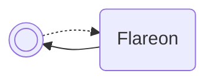

/// pokemon | Jolteon

//// tab | :octicons-cpu-24: ARM assembly
``` { .arm_v4 .annotate linenums="1" }
06 B5           PUSH    { r1, r2, lr }
1F 49           LDR     r1, flareon.GetBoxNamePtr
8E 46           CPY     lr, r1
00 F8           BL      lr
07 21           MOV     r1, #7
FF 22           MOV     r2, #0xFF

                terminatorLoop:
42 54           STRB    r2, [r0, r1]
01 39           SUB     r1, #1
FC D5           BPL     terminatorLoop
01 42           NOP
06 BC           POP     { r1, r2 }
00 29           CMP     r1, #0
01 D0           BEQ     writeAsDecimal
0B D1           BNE     writeAsHexadecimal
00 F0

                writeAsDecimal:
11 46           CPY     r1, r2
00 22           MOV     r2, #0
18 4B           LDR     r3, flareon.ConvertIntToDecimalStringN
9E 46           CPY     lr, r3
02 E0           B       #8
00 00
00 00
0F F3
08 23           MOV     r3, #8
00 F8           BL      lr
0A E0           B       return

                writeAsHexadecimal:
07 21           MOV     r1, #7

                charLoop:
13 07           LSL     r3, r2, #28
1B 0F           LSR     r3, r3, #28
12 09           LSR     r2, r2, #4
09 2B           CMP     r3, #9
00 D9           BLS     #4
10 33           ADD     r3, #16
A1 33           ADD     r3, #161
43 54           STRB    r3, [r0, r1]
01 39           SUB     r1, #1
F5 D5           BPL     charLoop

                return:
01 BC           POP     { r0 }
00 47           BX      r0
00 00
```
////

//// tab | :octicons-list-unordered-24: Box code
```box_code
Box  1: Br Uf SY 5G
Box  2: AP gH If 8i
Box  3: Ql QB Of zV
Box  4: AU IG vA Ap
Box  5: Ad AL 0Q Dw
Box  6: EU YA Ih hL
Box  7: nk YC 4A AA
Box  8: AA AP 8w gj
Box  9: AP gK 4A ch
Box 10: Ew cb Dx IJ
Box 11: CS sA 2R Az
Box 12: oT ND VA E5
Box 13: 9d UB vA BH
```
////

//// tab | :octicons-apps-24: PokeGlitzer
``` { .text .copy }
06 B5 1F 49   8E 46 00 F8
07 21 FF 22   42 54 01 39
FC D5 01 42   06 BC 00 29
01 D0 0B D1   00 F0 11 46
00 22 18 4B   9E 46 02 E0
00 00 00 00   0F F3 08 23
00 F8 0A E0   07 21 13 07
1B 0F 12 09   09 2B 00 D9
10 33 A1 33   43 54 01 39
F5 D5 01 BC   00 47 00 00
```
////

//// tab | :octicons-arrow-switch-24: Signature

///// html | div.signature
+-------+-----------------------------------+
| IN    | Function                          |
+=======+===================================+
| `r0`  | Box name index (indexed from 0)   |
+-------+-----------------------------------+
| `r1`  | Numeric base:                     |
|       |                                   |
|       | - `0x00` – Decimal                |
|       | - `0x01` – Hexadecimal            |
+-------+-----------------------------------+
| `r2`  | Value to write                    |
+-------+-----------------------------------+
/////

////

//// tab | :octicons-package-dependencies-24: Dependencies

////

///
