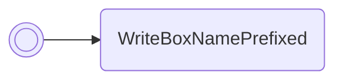

/// pokemon | Umbreon

//// tab | :octicons-cpu-24: ARM assembly
``` { .arm_v4 .annotate linenums="1" }
70 B4           PUSH    { r4-r6 }
01 B5           PUSH    { r0, lr }
00 24           MOV     r4, #0
06 A5           ADR     r5, statPrefixArray
02 35           ADD     r5, #2
40 BC           POP     { r6 }

                statLoop:
20 46           CPY     r0, r4
29 46           CPY     r1, r5
04 CE           LDMIA   r6!, { r2 }
01 42           NOP
FF F7           BL      flareon
CC FF           BL      flareon
03 35           ADD     r5, #3
0D E0           B       statLoopCoda
70 84
00 00
B4 90 C2 CA     .byte   #0xB4, #0x90, "HP"
00 BB E8 DF     .byte   " Atk"
BE D9 DA CD     .byte   "DefS"
E4 D9 CD E4     .byte   "peSp"
BB CD E4 BE     .byte   "ASpD"
00 00 00 00

                statLoopCoda:
01 34           ADD     r4, #1
06 2C           CMP     r4, #6
E6 D4           BMI     statLoop
71 BC           POP     { r0, r4-r6 }
00 47           BX      r0
00 00
00 00 00 00
00 00 00 00
00 00 00 00
```
////

//// tab | :octicons-list-unordered-24: Box code
```box_code
Box  1: cL QB tQ Ak
Box  2: Bq UC NU C8
Box  3: IE Yp Rg TO
Box  4: AU L? 98 z?
Box  5: Az UN 4H GE
Box  6: AA C1 kM LK
Box  7: AL vo 37 7Z
Box  8: 2s 3k 2c 3k
Box  9: u8 3k vg AA
Box 10: AA AB NA Ys
Box 11: 5t Rx vA BH
Box 12: AA AA AA AA
Box 13: AA AA AA AA
Box 14: AA AA AA AA
```
////

//// tab | :octicons-apps-24: PokeGlitzer
``` { .text .copy }
70 B4 01 B5   00 24 06 A5
02 35 40 BC   20 46 29 46
04 CE 01 42   FF F7 CC FF
03 35 0D E0   71 84 00 00
B5 90 C2 CA   00 BB E8 DF
BE D9 DA CD   E4 D9 CD E4
BB CD E4 BE   00 00 00 00
01 34 06 2C   E6 D4 71 BC
00 47 00 00   00 00 00 00
00 00 00 00   00 00 00 00
```
////

//// tab | :octicons-arrow-switch-24: Signature

///// html | div.signature
+-------+-----------------------------------------------------------+
| IN    | Function                                                  |
+=======+===========================================================+
| `r0`  | Array of 6 stat values (order is HP/Atk/Def/Spe/SpA/SpD)  |
+-------+-----------------------------------------------------------+
/////

////

//// tab | :octicons-package-dependencies-24: Dependencies

////

///
