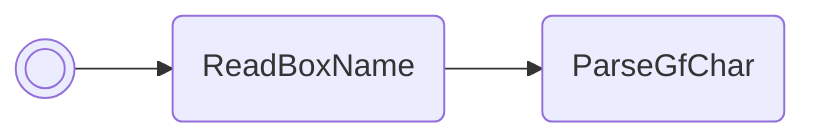

/// pokemon | Vaporeon

//// tab | :octicons-cpu-24: ARM assembly
``` { .arm_v4 .annotate linenums="1" }
1B 46           NOP
F7 B5           PUSH    { r0-r2, r4-r7, lr }
70 BC           POP     { r4-r6 }
00 27           MOV     r7, #0

                boxLoop:
B7 42           CMP     r7, r6
0D D2           BHS     return
38 46           CPY     r0, r7
01 21           MOV     r1, #1
29 40           AND     r1, r5
01 42           NOP
FF F7 CC FF     BL      eevee
01 C4           STMIA   r4!, { r0 }
02 E0           B       #8
A5 0E
00 00
ED FA
6D 08           LSR     r5, r5, #1
01 37           ADD     r7, #1
EF E7           B       boxLoop

                return:
F0 BC           POP     { r4-r7 }
01 BC           POP     { r0 }
00 47           BX      r0
00 00
00 00 00 00
00 00 00 00
00 00 00 00
00 00 00 00
00 00 00 00
00 00 00 00
00 00 00 00
00 00 00 00
```
////

//// tab | :octicons-list-unordered-24: Box code
```box_code
Box  1: G0 b3 tX C8
Box  2: AC e3 Qg 3S
Box  3: OE YB IS lA
Box  4: AU L? 98 z?
Box  5: Ac QC 4K UO
Box  6: AA Dt !m 0I
Box  7: AT fv 5? C8
Box  8: Ab wA Rw AA
```
////

//// tab | :octicons-apps-24: PokeGlitzer
``` { .text .copy }
1B 46 F7 B5   70 BC 00 27
B7 42 0D D2   38 46 01 21
29 40 01 42   FF F7 CC FF
01 C4 02 E0   A5 0E 00 00
ED FA 6D 08   01 37 EF E7
F0 BC 01 BC   00 47 00 00
00 00 00 00   00 00 00 00
00 00 00 00   00 00 00 00
00 00 00 00   00 00 00 00
00 00 00 00   00 00 00 00
```
////

//// tab | :octicons-arrow-switch-24: Signature

///// html | div.signature
+-------+-------------------------------------------+
| IN    | Function                                  |
+=======+===========================================+
| `r0`  | Pointer to array of values to read from   |
+-------+-------------------------------------------+
| `r1`  | Packed numeric base array                 |
+-------+-------------------------------------------+
| `r2`  | Number of boxes to write to               |
+-------+-------------------------------------------+
/////

////

//// tab | :octicons-package-dependencies-24: Dependencies

////

///
