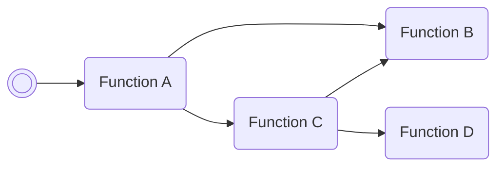

/// pokemon | Tab explanations
    open: true

//// tab | :octicons-cpu-24: ARM assembly

This tab is fairly self-explanatory: it shows what the Pokémon's data looks like
when it's instead interpreted by the game as code. If you're curious as to _how_
a script does what it does, this where to look. Familiarity with ARMv4 assembly
(Thumb in particular) is required, of course.

////

//// tab | :octicons-list-unordered-24: Box code

This tab is where you'll find the box code you'll need to enter to generate the
Pokémon in question.

There are 2 types of box codes you'll find in tutorial: hexadecimal (base 16)
and tetrasexagesimal (base 64). Hex codes are used by e-sh4rk's hex writer bad
egg, while the base 64 codes are used once we create our own base 64 writer
later in tutorial.

///// tab | Hexadecimal
```box_code
; Box code 1
Box  1: 84 00 00 00
Box  2: 46 97 00 00
Box  3: BE C9 CE CD
Box  4: FF 00 00 00
Box  5: 00 00 02 02
Box  6: C5 C9 BC BF
Box  7: FF 00 00 00
Box  8: 6C 37 00 00
Box  9: C2 97 00 00
Box 10: C2 97 1E 05

; Box code 2
Box  1: C7 92 05 0A
Box  2: E8 96 86 00
Box  3: A2 97 00 00
Box  4: C2 D1 00 00
Box  5: B7 97 6A 00
Box  6: C2 97 00 00
Box  7: C8 89 00 00
Box  8: C2 69 84 21
Box  9: 47 83 42 88
Box 10: C2 97 00 00
```
/////

///// tab | Base 64
```box_code
Box  1: hA AA AE aX
Box  2: AA C! yc 7N
Box  3: ?w AA AA AA
Box  4: Ag LF yb y?
Box  5: ?w AA AG w3
Box  6: AA DC lw AA
Box  7: wp ce Bc eS
Box  8: BQ ro lo YA
Box  9: op cA AM LR
Box 10: AA C3 l2 oA
Box 11: wp cA AM iJ
Box 12: AA DC aY Qh
Box 13: R4 NC iM KX
```
/////

You'll notice that some box codes seemingly do not make use of all 14 box names.
This is not actually the case; unlisted box names should be assumed to be
`00000000` for hexadecimal box codes & `AAAAAAAA` for base 64 box codes.

////

//// tab | :octicons-apps-24: PokeGlitzer

Here you'll find the glitch Pokémon's data presented in the same format used by
[PokeGlitzer](https://github.com/E-Sh4rk/PokeGlitzer), which is a save editing
tool for generation 3 meant for people interested in glitches.

If you just want to play around with these scripts without fiddling around with
box codes, just click the bottom in the top right of this tab to copy the data
to your clipboard. From there, right click an empty box slot in PokeGlitzer,
select "Open Hex Data Editor", and paste the data into the popup window (making
sure to replace the existing zeroed data). Save, and now your glitch Pokémon is
available in-game!

////

//// tab | :octicons-arrow-switch-24: Signature

This tab is for describing how a glitch Pokémon takes in arguments & returns
values. The tables found in this tab will differ depending on whether or not the
Pokémon is a library function or a script.

Library functions, like ROM functions, handle I/O via registers. Each register
holds a single 32-bit integer, so there's no need to worry about typing. An
example signature might be:

///// html | div.signature
+-------+-------------------+
| IN    | Function          |
+=======+===================+
| `r0`  | Integer value A   |
+-------+-------------------+
| `r1`  | Integer value B   |
+-------+-------------------+
/////

///// html | div.signature
+-------+-----------+
| OUT   | Function  |
+=======+===========+
| `r0`  | A + B     |
+-------+-----------+
/////

Scripts, however, are user-facing, and perform I/O via box names. Depending on
the script, a box name might be intepreted as a decimal integer, a hexadecimal
integer, or even a string. Because of that, we need to include typing
information when writing out their signatures. An example:

///// html | div.signature-typed
+-----------+---------------+-------------------+
| IN        | Type          | Function          |
+===========+===============+===================+
| `BOX1`    | `Decimal`     | Integer value A   |
+-----------+---------------+-------------------+
| `BOX2`    | `Decimal`     | Integer value B   |
+-----------+---------------+-------------------+
| `BOX3`    | `Hexadecimal` | Integer value B   |
+-----------+---------------+-------------------+
/////

///// html | div.signature-typed
+-----------+---------------+-----------+
| IN        | Type          | Function  |
+===========+===============+===========+
| `BOX1`    | `Decimal`     | A * B + C |
+-----------+---------------+-----------+
/////

A script with the above signature might read `17` from box 1, `21` from box 2, &
`C5` from box 3, and then print `554` in box 1.

I try to adhere to the ATPCS ABI when writing functions & scripts, and recommend
that you do too. You'll need to familiarize yourself with it regardless if you
plan on interacting with ROM functions in your scripts.

////

//// tab | :octicons-star-fill-24: Markings

Some glitch Pokémon can have their behavior modified by marking them in
particular ways. This tab will show what each marking does when (un)marked. An
example:

///// html | div.markings
+-------------------------------+-------------------+
| Marking                       | Function          |
+===============================+===================+
| :material-circle-outline:     | Turn off option A |
+-------------------------------+-------------------+
| :material-circle:             | Turn on option A  |
+-------------------------------+-------------------+
| :material-square-outline:     | Turn off option B |
+-------------------------------+-------------------+
| :material-square:             | Turn on option B  |
+-------------------------------+-------------------+
| :material-triangle-outline:   | Turn off option C |
+-------------------------------+-------------------+
| :material-triangle:           | Turn on option C  |
+-------------------------------+-------------------+
/////

Markings that do nothing will not appear in the table.

However, _most_ Pokémon that use markings do not care about the individual
marking states—instead, they care whether or not they're marked at all. For
these Pokémon, this tab will use a star to represent state of affairs:

///// html | div.markings
+---------------------------+---------------------------+
| Marking                   | Function                  |
+===========================+===========================+
| :material-star-outline:   | Skip optional action      |
+---------------------------+---------------------------+
| :material-star:           | Perform optional action   |
+---------------------------+---------------------------+
/////

Occasionally, the markings are not meant to be considered separately; instead,
the whole pattern is what holds meaning. In these cases, I print out the whole
pattern:

///// html | div.markings
+-------------------------------+-------------------+
| Marking                       | Function          |
+===============================+===================+
| :material-circle-outline:     | Perform action A  |
| :material-square-outline:     |                   |
| :material-triangle-outline:   |                   |
| :material-heart-outline:      |                   |
+-------------------------------+-------------------+
| :material-circle:             | Perform action B  |
| :material-square-outline:     |                   |
| :material-triangle-outline:   |                   |
| :material-heart-outline:      |                   |
+-------------------------------+-------------------+
| :material-circle-outline:     | Perform action C  |
| :material-square:             |                   |
| :material-triangle-outline:   |                   |
| :material-heart-outline:      |                   |
+-------------------------------+-------------------+
| :material-circle:             | Perform action D  |
| :material-square:             |                   |
| :material-triangle-outline:   |                   |
| :material-heart-outline:      |                   |
+-------------------------------+-------------------+
/////

In these cases, using patterns that aren't explicitly lists will generally cause
the script to fail.

////

//// tab | :octicons-package-dependencies-24: Dependencies

This tab shows you the dependencies of a given script or function. For instance,
take this diagram:



The double circle on the far left represents the current script, and an arrow
represents a dependency on some other function. In this example, our script will
call function A, which will in turn call function B & function C. Function C
also calls function B, additionally calling some other function D.

If a script has a dependency on a library function, that library function and
all of _its_ dependencies _must_ be present in their proper places in order for
the script to work. Ignoring dependencies will result in crashes.

////

///
