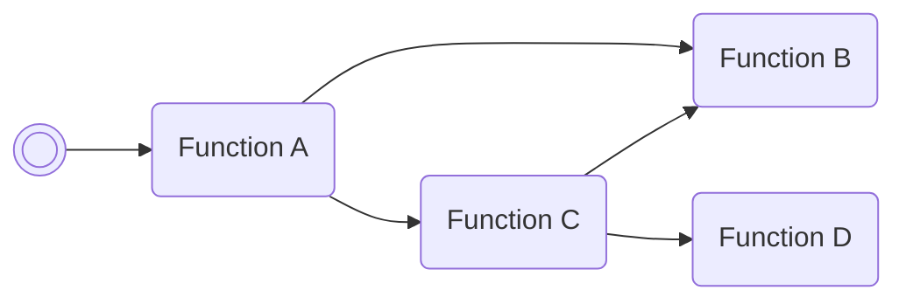

/// pokemon | Unown ["TestScript"]

//// tab | :octicons-cpu-24: ARM assembly
``` { .arm_v4 .annotate linenums="1" }
83 B0           SUB     sp, #12
68 46           CPY     r0, sp
04 21           MOV     r1, #4
05 E0           B       #14
CE D9 E7 E8     .byte   "Test"
CD D7 E6 DD     .byte   "Scri"
E4 E8 02 02     .byte   "pt", #0x02, #0x02
03 22           MOV     r2, #3
09 9B           LDR     r3, sp.ReadBoxNameMulti
9E 46           CPY     lr, r3
00 E0           B       #4
A3 A5
00 F8           BL      lr
07 BC           POP     { r0-r2 }
48 43           MUL     r0, r1
80 18           ADD     r0, r0, r2
18 21           MOV     r1, #24
06 4A           LDR     r2, __umodsi3
00 E0           B       #4
4E 91
96 46           CPY     lr, r2
00 F8           BL      lr
02 46           CPY     r2, r0
00 20           MOV     r0, #0
00 21           MOV     r1, #0
07 9B           LDR     r3, sp.WriteBoxName
9E 46           CPY     lr, r3
00 F8           BL      lr
00 20           MOV     r0, #0
06 E0           B       nextFreeBoxSlot
00 00

                __umodsi3:
E1 7B 2E 08     .word   #0x082E7BE1
00 00 00 00
00 00 00 00
```
////

//// tab | :octicons-list-unordered-24: Box code

///// tab | Emerald
```box_code
```
/////

///// tab | FireRed v1.0
```box_code
```
/////

///// tab | FireRed v1.1
```box_code
```
/////

///// tab | LeafGreen v1.0
```box_code
```
/////

///// tab | LeafGreen v1.1
```box_code
```
/////

////

//// tab | :octicons-apps-24: PokeGlitzer

///// tab | Emerald
``` { .text .copy }
```
/////

///// tab | FireRed v1.0
``` { .text .copy }
```
/////

///// tab | FireRed v1.1
``` { .text .copy }
```
/////

///// tab | LeafGreen v1.0
``` { .text .copy }
```
/////

///// tab | LeafGreen v1.1
``` { .text .copy }
```
/////

////

//// tab | :octicons-arrow-switch-24: Signature

///// html | div.signature
+-------+-------------------+
| IN    | Function          |
+=======+===================+
| `r0`  | Integer value A   |
+-------+-------------------+
| `r1`  | Integer value B   |
+-------+-------------------+
| `r2`  | Integer value C   |
+-------+-------------------+
/////

///// html | div.signature
+-------+-----------------------+
| OUT   | Function              |
+=======+=======================+
| `r0`  | (A * B + C) mod 24    |
+-------+-----------------------+
/////

///// html | div.signature-typed
+-----------+---------------+-------------------+
| IN        | Type          | Function          |
+===========+===============+===================+
| `BOX1`    | `Decimal`     | Integer value A   |
+-----------+---------------+-------------------+
| `BOX2`    | `Decimal`     | Integer value B   |
+-----------+---------------+-------------------+
| `BOX3`    | `Hexadecimal` | Integer value C   |
+-----------+---------------+-------------------+
/////

///// html | div.signature-typed
+-----------+---------------+-----------------------+
| OUT       | Type          | Function              |
+===========+===============+=======================+
| `BOX1`    | `Decimal`     | (A * B + C) mod 24    |
+-----------+---------------+-----------------------+
/////

////

//// tab | :octicons-star-fill-24: Markings

///// html | div.markings
+-------------------------------+---------------------------+
| Marking                       | Function                  |
+===============================+===========================+
| :material-circle-outline:     | Turn option A off         |
+-------------------------------+---------------------------+
| :material-circle:             | Turn option A on          |
+-------------------------------+---------------------------+
| :material-square-outline:     | Turn option B off         |
+-------------------------------+---------------------------+
| :material-square:             | Turn option B on          |
+-------------------------------+---------------------------+
| :material-triangle-outline:   | Turn option C off         |
+-------------------------------+---------------------------+
| :material-triangle:           | Turn option C on          |
+-------------------------------+---------------------------+
| :material-heart-outline:      | Turn option D off         |
+-------------------------------+---------------------------+
| :material-heart:              | Turn option D on          |
+-------------------------------+---------------------------+
| :material-star-outline:       | Skip optional action      |
+-------------------------------+---------------------------+
| :material-star:               | Perform optional action   |
+-------------------------------+---------------------------+
/////

////

//// tab | :octicons-package-dependencies-24: Dependencies

////

///
