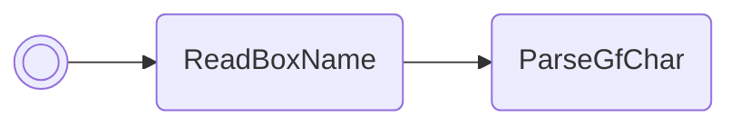

/// pokemon | Blissey ["SetLevel"]<span class="script-pos">1 of 2</span>
    open: true

//// tab | :octicons-cpu-24: ARM assembly
``` { .arm_v4 .annotate linenums="1" }
00 20           MOV     r0, #0
00 21           MOV     r1, #0
05 9A           LDR     r2, sp.eevee
05 E0           B       #14
CD D9 E8 C6     .byte   "SetL"
D9 EA D9 E0     .byte   "evel"
FF FF 02 02     .byte   #0xFF, #0xFF, #0x02, #0x02
96 46           CPY     lr, r2
00 F8           BL      lr
00 28           CMP     r0, #0
00 E0           B       #4
C7 97
34 D0           BEQ     blisseyB.returnErr
64 28           CMP     r0, #100
32 D8           BHI     blisseyB.returnErr
80 00           LSL     r0, r0, #2
01 E0           B       #6
00 00
00 00
80 46           CPY     r8, r0
12 A4           ADR     r4, blisseyB.GetBoxMonData
F0 CC           LDMIA   r4, { r4-r7 }
03 98           LDR     r0, sp.gPokemonStorage
04 30           ADD     r0, #4
00 E0           B       #4
F7 BA
0B 21           MOV     r1, #MON_DATA_SPECIES
A6 46           CPY     lr, r4
00 F8           BL      lr
1C 21           MOV     r1, #28
48 43           MUL     r0, r1
13 30           ADD     r0, #19
30 5C           LDRB    r0, [r6, r0]
CA 21           MOV     r1, #202
48 43           MUL     r0, r1
40 00           LSL     r0, r0, #1
40 44           ADD     r0, r8
```
////

//// tab | :octicons-list-unordered-24: Box code
```box_code
Box  1: AC AA IQ Wa
Box  2: Be DN 2e jG
Box  3: 2e rZ 4P ??
Box  4: Ag KW Rg D4
Box  5: AC gA 4M eX
Box  6: NN Bk KD LY
Box  7: gA AB 4A AA
Box  8: AA CA Rh Kk
Box  9: 8M wD mA Qw
Box 10: AO D3 ug sh
Box 11: pk YA !B wh
Box 12: SE MT MD Bc
Box 13: yi FI Q0 AA
Box 14: QE QA AA AA
```
/////

////

//// tab | :octicons-apps-24: PokeGlitzer
``` { .text .copy }
00 20 00 21   05 9A 05 E0
CD D9 E8 C6   D9 EA D9 E0
FF FF 02 02   96 46 00 F8
00 28 00 E0   C7 97 34 D0
64 28 32 D8   80 00 01 E0
00 00 00 00   80 46 12 A4
F0 CC 03 98   04 30 00 E0
F7 BA 0B 21   A6 46 00 F8
1C 21 48 43   13 30 30 5C
CA 21 48 43   40 00 40 44
```
////

//// tab | :octicons-arrow-switch-24: Signature

///// html | div.signature-typed
+-----------+---------------+-------------------------------------------+
| IN        | Type          | Function                                  |
+===========+===============+===========================================+
| `BOX1`    | `Decimal`     | Level to set Pokémon in box 1, slot 1 to; |
|           |               | value must be in the range 1–100          |
+-----------+---------------+-------------------------------------------+
/////

////

//// tab | :octicons-package-dependencies-24: Dependencies

////

///
