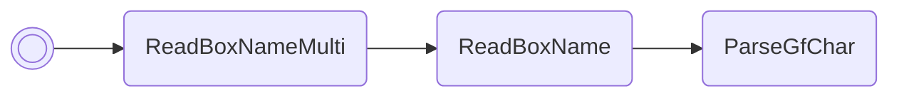

/// pokemon | Delcatty ["SetSwarm"]<span class="script-pos">1 of 2</span>
    open: true

//// tab | :octicons-cpu-24: ARM assembly

///// tab | Emerald
``` { .arm_v4 .annotate linenums="1" }
01 9C           LDR     r4, sp.gSaveBlock1
A4 20           MOV     r0, #164
44 21           MOV     r1, #68
05 E0           B       #14
CD D9 E8 CD     .byte   "SetS"
EB D5 E6 E1     .byte   "warm"
FF FF 02 02     .byte   #0xFF, #0xFF, #0x02, #0x02
48 43           MUL     r0, r1
24 18           ADD     r4, r4, r0
01 E0           B       #6
00 00
CD F2
78 46           CPY     r0, pc
07 38           SUB     r0, #7
00 78           LDRB    r0, [r0]
00 28           CMP     r0, #0
05 D0           BEQ     startMassOutbreak

                stopMassOutbreak:
00 20           MOV     r0, #0
04 21           MOV     r1, #4

                zeroLoop:
01 C4           STMIA   r4!, { r0 }
01 39           SUB     r1, #1
FC D5           BPL     zeroLoop
35 D4           BMI     nextFreeBoxSlot

                startMassOutbreak:
8A B0           SUB     sp, #40
68 46           CPY     r0, sp
F7 21           MOV     r1, #0b11110111
0A 22           MOV     r2, #10
10 9B           LDR     r3, sp.ReadBoxNameMulti
02 E0           B       #8
00 00
00 00
79 BC
9E 46           CPY     lr, r3
00 F8           BL      lr
0F BC           POP     { r0-r3 }
E0 70           STRB    r0, [r4, #3]
A1 70           STRB    r1, [r4, #2]
```
/////

///// tab | FireRed/LeafGreen
```text
Not available
```
/////

////

//// tab | :octicons-list-unordered-24: Box code

///// tab | Emerald
```box_code
Box  1: AZ yk IE Qh
Box  2: Be DN 2e jN
Box  3: 69 Xm 4f ??
Box  4: Ag JI Qy QY
Box  5: Ae AA AM 3y
Box  6: eE YH OA B4
Box  7: AC gF 0A Ag
Box  8: BC EB xA E5
Box  9: ?N U1 1I qw
Box 10: aE b3 IQ oi
Box 11: EJ sC 4A AA
Box 12: AA B5 vJ 5G
Box 13: AP gP vO Bw
Box 14: oX AA AA AA
```
/////

///// tab | FireRed/LeafGreen
```text
Not available
```
/////

////

//// tab | :octicons-apps-24: PokeGlitzer

///// tab | Emerald
``` { .text .copy }
01 9C A4 20   44 21 05 E0
CD D9 E8 CD   EB D5 E6 E1
FF FF 02 02   48 43 24 18
01 E0 00 00   CD F2 78 46
07 38 00 78   00 28 05 D0
00 20 04 21   01 C4 01 39
FC D5 35 D4   8A B0 68 46
F7 21 0A 22   10 9B 02 E0
00 00 00 00   79 BC 9E 46
00 F8 0F BC   E0 70 A1 70
```
/////

///// tab | FireRed/LeafGreen
```text
Not available
```
/////

////

//// tab | :octicons-arrow-switch-24: Signature

///// html | div.signature-typed
+-----------+---------------+-------------------------------+
| IN        | Type          | Function                      |
+===========+===============+===============================+
| `BOX1`    | `Hexadecimal` | Map group ID                  |
+-----------+---------------+-------------------------------+
| `BOX2`    | `Hexadecimal` | Map num ID                    |
+-----------+---------------+-------------------------------+
| `BOX3`    | `Hexadecimal` | Pokémon species ID            |
+-----------+---------------+-------------------------------+
| `BOX4`    | `Decimal`     | Pokémon level                 |
+-----------+---------------+-------------------------------+
| `BOX5`    | `Hexadecimal` | Move #1 ID                    |
+-----------+---------------+-------------------------------+
| `BOX6`    | `Hexadecimal` | Move #2 ID                    |
+-----------+---------------+-------------------------------+
| `BOX7`    | `Hexadecimal` | Move #3 ID                    |
+-----------+---------------+-------------------------------+
| `BOX8`    | `Hexadecimal` | Move #4 ID                    |
+-----------+---------------+-------------------------------+
| `BOX9`    | `Decimal`     | Encounter probability (0–100) |
+-----------+---------------+-------------------------------+
| `BOX10`   | `Decimal`     | Days remaining in outbreak    |
+-----------+---------------+-------------------------------+
/////

////

//// tab | :octicons-star-fill-24: Markings

///// html | div.markings
+-------------------------------+-----------------------------------+
| Marking                       | Function                          |
+===============================+===================================+
| :material-star-outline:       | Starts a mass outbreak            |
+-------------------------------+-----------------------------------+
| :material-star:               | Stops any ongoing mass outbreak   |
+-------------------------------+-----------------------------------+
/////

////

//// tab | :octicons-package-dependencies-24: Dependencies

////

///
