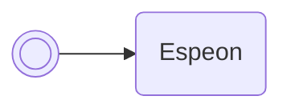

/// pokemon | Magneton ["CalcHidPwr"]<span class="script-pos">1 of 3</span>
    open: true

//// tab | :octicons-cpu-24: ARM assembly
``` { .arm_v4 .annotate linenums="1" }
03 9C           LDR     r4, sp.gPokemonStorage
00 25           MOV     r5, #0
00 26           MOV     r6, #0
05 E0           B       #14
BD D5 E0 D7     .byte   "Calc"
C2 DD D8 CA     .byte   "HidP"
EB E6 02 02     .byte   "wr", #0x02, #0x02
00 27           MOV     r7, #0
02 42           NOP

                statLoop:
20 1D           ADD     r0, r4, #4
00 E0           B       #4
A7 99
27 21           MOV     r1, #0x27
49 19           ADD     r1, r1, r5
1D 4A           LDR     r2, magnetonB.GetBoxMonData
96 46           CPY     lr, r2
00 F8           BL      lr
01 21           MOV     r1, #1
00 E0           B       #4
51 BA
01 40           AND     r1, r0
A9 40           LSL     r1, r1, r5
76 18           ADD     r6, r6, r1
40 08           LSR     r0, r0, #1
01 21           MOV     r1, #1
01 40           AND     r1, r0
A9 40           LSL     r1, r1, r5
7F 18           ADD     r7, r7, r1
01 35           ADD     r5, #1
06 2D           CMP     r5, #6
E9 D3           BLO     statLoop
28 20           MOV     r0, #40
78 43           MUL     r0, r7
14 4F           LDR     r7, magnetonB.__udivsi3
01 E0           B       #6
00 00
00 00
```
////

//// tab | :octicons-list-unordered-24: Box code
```box_code
Box  1: A5 wA JQ Am
Box  2: Be C9 1e DX
Box  3: wt 3Y yu vm
Box  4: Ag IA Jw JC
Box  5: IB 0A 4K eZ
Box  6: Jy FJ GR 1K
Box  7: lk YA !A Eh
Box  8: AO BR ug FA
Box  9: qU B2 GE AI
Box 10: AS EB QK lA
Box 11: fx gB NQ Yt
Box 12: 6d Mo IH hD
Box 13: FE 8B 4A AA
```
////

//// tab | :octicons-apps-24: PokeGlitzer
``` { .text .copy }
03 9C 00 25   00 26 05 E0
BD D5 E0 D7   C2 DD D8 CA
EB E6 02 02   00 27 02 42
20 1D 00 E0   A7 99 27 21
49 19 1D 4A   96 46 00 F8
01 21 00 E0   51 BA 01 40
A9 40 76 18   40 08 01 21
01 40 A9 40   7F 18 01 35
06 2D E9 D3   28 20 78 43
14 4F 01 E0   00 00 00 00
```
////

//// tab | :octicons-arrow-switch-24: Signature

///// html | div.signature-typed
+-----------+---------------+-----------------------------------------------+
| OUT       | Type          | Function                                      |
+===========+===============+===============================================+
| `BOX1`    | `String`      | Type & power of Hidden Power for the Pokémon  |
|           |               | in box 1, slot 1                              |
+-----------+---------------+-----------------------------------------------+
/////

////

//// tab | :octicons-package-dependencies-24: Dependencies

////

///
